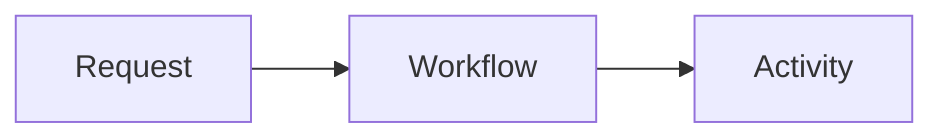

# jaeyoung0509

A statically exported engineering blog built with Next.js App Router and MDX.
Korean is the primary content language.

## Features

- File-based posts authored in `content/posts/*.mdx`
- Frontmatter for publishing dates, tags, locale, draft status, and cover media
- Static export for GitHub Pages
- Search and tag filtering
- Generated table of contents
- Syntax highlighting and code-copy controls
- Mermaid diagrams in fenced code blocks
- Responsive, privacy-enhanced YouTube embeds
- YouTube videos as playable article covers and list thumbnails
- Rich link preview cards with author-provided metadata
- RSS feed, sitemap, Open Graph metadata, and JSON-LD
- Optional Giscus comments
- Static rendering regression tests for MDX features

## Commands

```sh
npm install
npm run dev
npm run lint
npm run build
npm test
```

The local development server uses webpack instead of Turbopack because the
project encountered a Turbopack HMR panic while compiling dynamic MDX routes.

`npm test` runs ESLint, the production build, static export, and MDX rendering
regression tests. The exported site is written to `out/`.

## Writing a post

Add posts under `content/posts/*.mdx`.

```yaml
---
title: "Post title"
description: "Description used in search results and social cards"
publishedAt: "2026-07-30"
updatedAt: "2026-07-31"
tags: ["Backend", "AWS"]
locale: "ko"
featured: false
draft: false
cover: "/images/cover.jpg"
coverAlt: "Accessible image description"
---
```

Posts with `draft: true` are excluded from post listings, the sitemap, the RSS
feed, and generated static routes.

### YouTube article cover

Use the following fields instead of `cover` when a YouTube video should be the
main article media:

```yaml
coverYoutubeId: "k8cnVCMYmNc"
coverYoutubeTitle: "OpenAI and Temporal: Building Durable Agents"
```

The article page renders a playable video. Post listings and social metadata use
the corresponding YouTube thumbnail.

## Global MDX components

The following features are available in every `content/posts/*.mdx` file without
imports.

### Mermaid

Use a fenced code block with the `mermaid` language:

````md

````

### YouTube

Pass the video ID from the YouTube URL and an accessible title:

```mdx
<YouTube
  videoId="k8cnVCMYmNc"
  title="OpenAI and Temporal: Building Durable Agents"
  caption="Optional caption shown below the video"
/>
```

`caption` is optional. Embeds are responsive, lazy-loaded, and use
`youtube-nocookie.com`.

### Link preview

Use a link preview card for external documentation or repositories:

```mdx
<LinkPreview
  href="https://docs.temporal.io/ai-cookbook/openai-agents-sdk-python"
  site="Temporal Docs"
  title="Durable agent with tools using the OpenAI Agents SDK"
  description="A short description of the linked resource."
/>
```

Titles and descriptions are authored explicitly. The build does not fetch remote
Open Graph metadata, which keeps static builds deterministic and available
offline.

## Giscus comments

1. Enable Discussions under the repository's `Settings > Features` section.
2. Create a Discussion category for comments.
3. Install the [Giscus GitHub App](https://github.com/apps/giscus).
4. Generate the configuration at [giscus.app](https://giscus.app/) and add it to
   `.env.local`.

```sh
NEXT_PUBLIC_GISCUS_REPO=owner/repository
NEXT_PUBLIC_GISCUS_REPO_ID=...
NEXT_PUBLIC_GISCUS_CATEGORY=Comments
NEXT_PUBLIC_GISCUS_CATEGORY_ID=...
```

The comments section is not rendered when these values are absent. For GitHub
Pages deployments, create Repository Variables with the same names so the
workflow can pass them to the build.

## Deployment

`.github/workflows/deploy.yml` builds and deploys the static export to GitHub
Pages on pushes to `main`. Configure the repository's Pages source as
`GitHub Actions`.
