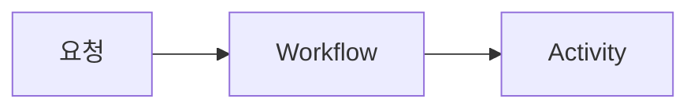

# jaeyoung0509

한국어를 기본으로 운영하는 Next.js App Router 기반 MDX 기술 블로그입니다.

## Commands

```sh
npm install
npm run dev
npm run lint
npm run build
npm test
```

로컬 개발 서버는 Turbopack HMR 대신 안정적인 webpack 모드로 실행됩니다.
`npm test`는 lint, production build, MDX 정적 렌더링 회귀 테스트를 순서대로 실행합니다.

정적 배포 결과는 `out/`에 생성됩니다.

## Writing

글은 `content/posts/*.mdx`에 추가합니다.

```yaml
---
title: "글 제목"
description: "검색 결과와 공유 카드에 사용할 설명"
publishedAt: "2026-07-30"
updatedAt: "2026-07-31"
tags: ["Backend", "AWS"]
locale: "ko"
featured: false
draft: false
cover: "/images/cover.jpg"
coverAlt: "이미지 설명"
# YouTube 영상을 대표 커버로 쓸 때는 cover 대신 아래 두 필드를 사용합니다.
coverYoutubeId: "k8cnVCMYmNc"
coverYoutubeTitle: "영상 내용을 설명하는 제목"
---
```

`draft: true`인 글은 목록, sitemap, RSS와 정적 경로에서 제외됩니다.
`coverYoutubeId`를 지정하면 글 상세에서는 재생 가능한 영상이 대표 커버로,
글 목록과 공유 메타데이터에서는 YouTube 썸네일이 사용됩니다.

### MDX components

`content/posts/*.mdx`에서는 아래 문법을 별도 import 없이 사용할 수 있습니다.

#### Mermaid

코드 블록의 언어를 `mermaid`로 지정하면 반응형 다이어그램으로 렌더링됩니다.

````md

````

#### YouTube

YouTube URL의 `v=` 뒤에 있는 video ID와 접근성에 사용할 제목을 입력합니다.

```mdx
<YouTube
  videoId="k8cnVCMYmNc"
  title="OpenAI and Temporal: Building Durable Agents"
  caption="영상 아래에 표시할 선택 설명"
/>
```

`caption`은 생략할 수 있습니다. 영상은 반응형 비율, lazy loading,
`youtube-nocookie.com` 주소를 사용해 모든 블로그 글에서 동일하게 렌더링됩니다.

#### Link preview

외부 문서나 저장소를 제목과 설명이 있는 카드로 표시합니다. 외부 사이트의
메타데이터를 빌드 중 가져오지 않으므로 제목과 설명을 직접 작성해야 합니다.

```mdx
<LinkPreview
  href="https://docs.temporal.io/ai-cookbook/openai-agents-sdk-python"
  site="Temporal Docs"
  title="Durable agent with tools using the OpenAI Agents SDK"
  description="링크 내용을 한두 문장으로 설명합니다."
/>
```

## Giscus comments

1. GitHub 저장소의 `Settings > Features > Discussions`를 활성화합니다.
2. 댓글 전용 Discussion category를 생성합니다.
3. [Giscus GitHub App](https://github.com/apps/giscus)을 저장소에 설치합니다.
4. [giscus.app](https://giscus.app/ko)에서 생성한 값을 `.env.local`에 넣습니다.

```sh
NEXT_PUBLIC_GISCUS_REPO=owner/repository
NEXT_PUBLIC_GISCUS_REPO_ID=...
NEXT_PUBLIC_GISCUS_CATEGORY=Comments
NEXT_PUBLIC_GISCUS_CATEGORY_ID=...
```

설정값이 없으면 댓글 영역은 렌더링하지 않습니다. GitHub Pages 배포에서는
같은 이름의 Repository Variables를 등록하면 workflow가 값을 전달합니다.

## Deployment

`.github/workflows/deploy.yml`이 `main` push 시 정적 export를 GitHub Pages에
배포합니다. Pages의 Source는 `GitHub Actions`로 설정합니다.
