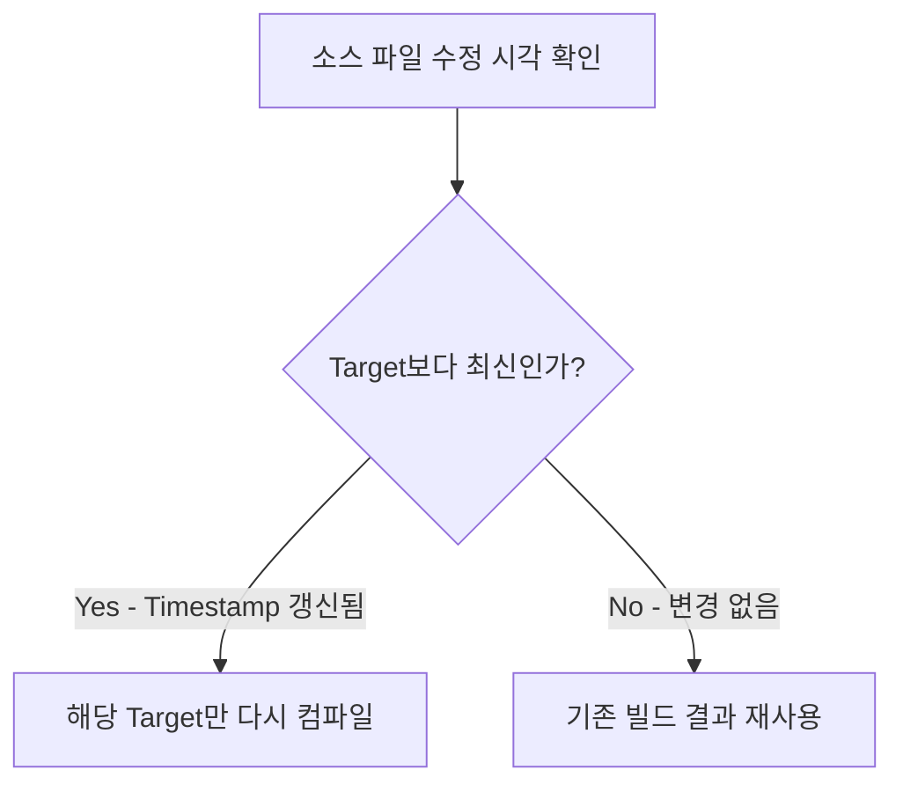
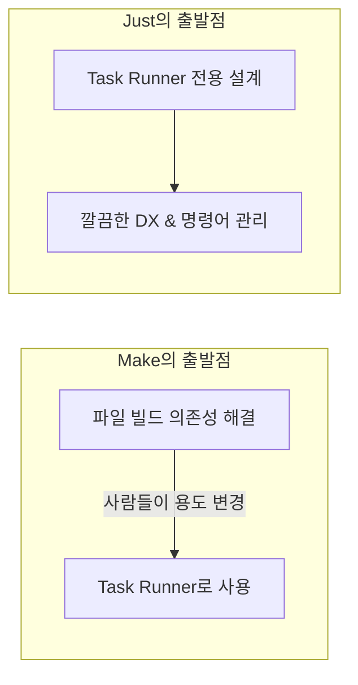

# Makefile에서 Just로 이사오기: 우리가 Makefile을 Task Runner로 사용했던 이유와 현대적인 대안들

Go 프로젝트를 진행하면서 자연스럽게 `Makefile`을 사용하게 되었습니다.

처음에는 단순히 `build`, `test`, `lint` 같은 긴 명령어를 짧게 실행하기 위한 용도로 사용했습니다.

```bash
make test
make dev
make deploy
```

팀원들과 명령어 인터페이스를 맞추기에도 좋았고, 터미널에서 짧게 치면 되니 정말 편리했습니다. 저에게 Makefile은 그저 **"프로젝트 명령어를 모아두는 편리한 파일"**이었습니다.

그러다 최근 Temporal Python SDK 내부 코드를 살펴보다가 `just`라는 커맨드를 발견했고, 호기심에 제 프로젝트에 직접 사용해보게 되었습니다.

그런데 Just를 써보면서 한 가지 근본적인 궁금증이 생겼습니다.

> **"우리는 왜 1970년대에 나온 빌드 도구인 Makefile을 지금까지 Task Runner처럼 사용하고 있었을까?"**

이 질문을 따라가다 보니, 제가 오해하고 있던 Make의 본래 철학과 함께 왜 현대 개발 환경에서 Just나 Taskfile 같은 도구들이 주목받는지 자연스럽게 이해할 수 있었습니다. 제가 배우고 체득한 과정을 차근차근 정리해보려 합니다.

---

## 1. 제가 크게 오해했던 부분: Make의 본질은 Task Runner가 아니었다

저도 처음에는 Makefile을 단순히 터미널 명령어를 줄여주는 스크립트 모음집 정도로 생각했습니다. 하지만 Make의 역사를 찾아보면서 완전히 다른 도구라는 것을 알게 되었습니다.

Make는 1976년 Bell Labs의 **Stuart Feldman**이 만들었습니다.


당시 Unix 환경에서는 C 프로젝트 규모가 커질수록 빌드 시간이 큰 문제였습니다. 수천 개의 파일 중 `network.c` 하나만 수정했는데 전체 프로젝트를 처음부터 다시 컴파일(`gcc`)해야 한다면 엄청난 시간 낭비였기 때문입니다.

Make가 해결하려던 문제는 아주 명확했습니다.

> **"변경된 파일만 다시 빌드하자 (Incremental Build)"**



Make는 타깃 파일(Target)과 소스 파일의 **수정 시각(Timestamp)**을 비교해, 소스가 더 최신일 때만 해당 타깃을 다시 컴파일합니다.

```text
main.c  (10:00 수정)
main.o  (09:00 빌드됨)
→ main.c가 더 최신이므로 main.o만 다시 빌드
```

즉, **Make의 본질은 명령어를 실행하는 Task Runner가 아니라, 파일 간의 의존성 그래프(DAG)를 계산해 최소한의 빌드만 수행하는 '빌드 시스템'**이었습니다.

---

## 2. 그런데 왜 Go 프로젝트에서는 아직 Makefile을 많이 쓸까?

여기서 흥미로운 점이 있습니다. 

사실 Go는 Make가 본래 해결하려던 '빌드 의존성 그래프' 문제를 겪지 않습니다. 이미 `go build`와 `go test` 자체가 패키지 간의 의존성을 완벽히 파악하고 내부 캐시를 이용해 변경된 부분만 알아서 빌드하기 때문입니다.

그런데도 왜 거의 모든 Go 프로젝트 루트에는 `Makefile`이 놓여 있을까요?

**Go 빌드 자동화 때문이 아니라, "프로젝트 명령어 인터페이스 표준화" 때문이었습니다.**

실제 프로젝트를 운영하면 외워야 할 명령어가 정말 많아집니다.

```bash
go test -v -race ./...
golangci-lint run --timeout=5m
docker compose -f docker-compose.dev.yml up -d
buf generate
```

이걸 팀원마다 다르게 입력하지 않도록, `make test`, `make dev`라는 표준 진입점으로 감싸둔 것입니다.

```make
.PHONY: test lint dev

test:
	go test -v -race ./...

lint:
	golangci-lint run

dev:
	docker compose -f docker-compose.dev.yml up -d
```

결국 우리는 **빌드 의존성을 해결하는 도구(Make)**를 가져와서, **단순 명령어 실행기(Task Runner)**라는 다른 용도로 사용해왔던 것입니다.

---

## 3. Makefile을 Task Runner로 쓰면서 느꼈던 아쉬움들

물론 Makefile은 어디에나 기본 설치되어 있고 생태계가 워낙 견고해서 여전히 강력합니다. 하지만 순수하게 '명령어 관리' 목적으로 쓰다 보면 몇 가지 불편한 점들이 있었습니다.

### 1) 들여쓰기 TAB 제약
Makefile에서는 레시피 앞을 **반드시 `TAB`**으로 들여써야 합니다. 스페이스 4칸을 넣으면 즉시 에러(`missing separator`)가 납니다. 익숙해지면 조심하지만, 단순히 커맨드를 정리하려는 용도에서 이런 제약까지 신경 써야 한다는 점은 조금 어색했습니다.

### 2) Shell script와의 어색한 결합
명령어가 조금만 길어지거나 순차 실행이 필요하면 라인 끝마다 `\`와 `&&`를 이어붙여야 하고, 변수를 참조할 때도 `$$VAR`처럼 이스케이프해야 합니다. 점점 읽기 어려운 쉘 스크립트 덩어리가 되기 십상입니다.

### 3) `.PHONY` 남발
Make는 기본적으로 타깃을 '생성될 파일명'으로 인식합니다. 폴더에 우연히 `test`라는 폴더나 파일이 있으면 `make test`는 "이미 최신 상태"라며 실행되지 않습니다. 이를 막기 위해 매번 `.PHONY: test lint dev`를 선언해줘야 했습니다.

---

## 4. Just: Makefile의 편리함은 살리고 문법은 현대화한 도구

이런 배경 속에서 등장한 도구가 바로 **Just**입니다.

2016년 Casey Rodarmor가 Rust로 개발했는데, 만든 동기가 매우 와닿았습니다.


> "나는 Makefile 문법은 싫지만, make의 편리함은 좋아한다."

Just의 공식 철학은 아주 단순합니다.

> **"A handy way to save and run project-specific commands"**
> (프로젝트 전용 명령어를 저장하고 실행하는 가장 편리한 방법)

Make가 *"어떻게 빌드 의존성을 해결할까?"*를 고민했다면, Just는 처음부터 *"어떻게 개발자가 필요한 명령을 쉽게 실행할까?"*라는 **Task Runner 목적 하나에만 집중**해 설계되었습니다.



---

## 5. 실제로 써보며 체감한 Just의 장점들

`justfile`로 전환하면서 가장 마음에 들었던 점들을 정리해보았습니다.

### 1) TAB 제약이 없는 직관적인 문법
스페이스든 탭이든 자유롭게 들여쓰기를 사용할 수 있습니다.

```just
test:
    go test -v -race ./...

lint:
    golangci-lint run
```

### 2) 파라미터(인자) 전달과 기본값 지원
Makefile에서 인자를 받으려면 환경변수 트릭(`make deploy ENV=prod`)을 쓰거나 복잡한 가드를 짜야 했습니다. Just는 함수 시그니처처럼 인자와 기본값을 바로 선언할 수 있습니다.

```just
# 기본값 dev, 필요시 인자로 덮어쓰기
deploy env="dev":
    @echo "Deploying to {{env}}..."
    kubectl apply -f infra/k8s/{{env}}/
```

```bash
just deploy       # dev 환경 배포
just deploy prod  # prod 환경 배포
```

만약 필수 인자가 누락되면 Just가 친절하게 사용법(Usage)을 에러로 알려줍니다.

### 3) 사전 도구 및 환경변수 검증 (Fail Fast)
태스크가 한참 돌다가 마지막 단계에서 도구가 없어 실패하면 난감합니다. Just에서는 백틱(`` ` ``)을 이용해 필수 도구가 있는지 사전에 검증할 수 있습니다.

```just
# 필수 도구 사전 검증 (없으면 즉시 중단)
golangci := `which golangci-lint`

# .env 자동 로드
set dotenv-load
```

> 💡 **Bonus Tip: `uv`가 있다면 Just 무설치로 실행하기**
> 
> Justfile 맨 위에 `#!/usr/bin/env -S uvx --from=rust-just just --justfile` 셰뱅을 넣고 실행 권한(`chmod +x justfile`)을 주면, 시스템에 `just`가 설치되어 있지 않아도 Python의 `uv`를 통해 `./justfile test`로 즉시 실행할 수 있습니다.

---

## 6. 또 하나의 흥미로운 대안: Taskfile (go-task)

그런데 Just를 사용하다 보니 또 하나의 흥미로운 선택지가 보였습니다.

바로 Go 생태계에서 만들어진 **[Taskfile (go-task)](https://taskfile.dev)**입니다.

```yaml
# Taskfile.yml 예시
version: '3'

tasks:
  build:
    desc: "서버 바이너리 빌드"
    sources:
      - '**/*.go'
    generates:
      - bin/server
    cmds:
      - go build -o bin/server main.go

  test:
    desc: "단위 테스트 실행"
    cmds:
      - go test -v ./...
```

Just가 Make의 문법 문제를 해결하는 데 집중했다면, Taskfile은 **Make의 Incremental Build 철학(스마트 캐싱)까지 일부 가져온 현대적 Task Runner**입니다.

* **크로스 플랫폼 내장 쉘 ([mvdan/sh](https://github.com/mvdan/sh))**: 윈도우, macOS, Linux 환경 차이 없이 동일하게 쉘 명령어가 동작합니다.
* **파일 해시 기반 스마트 캐싱 (`sources` / `generates`)**: 소스 코드가 변경되지 않았다면 태스크 실행을 자동으로 스킵합니다.
* **병렬 실행 (`--parallel`) & 모듈화 (`includes`)**: 여러 태스크를 동시에 돌리거나 하위 Taskfile을 임포트하기 편리합니다.

---

## 7. Make vs Just vs Taskfile 한눈에 비교하기

세 도구를 비교하면 다음과 같이 정리할 수 있습니다.

| 비교 항목 | Makefile (Make) | Justfile (Just) | Taskfile (Task) |
| :--- | :--- | :--- | :--- |
| **태생 & 언어** | 1976년 (C) | 2016년 (Rust) | 2017년 (Go) |
| **설정 포맷** | 고유 문법 (TAB 필수) | Make와 유사한 간결한 DSL | `Taskfile.yml` (YAML) |
| **주 목적** | 컴파일 의존성 해결 (DAG) | 커맨드 러너 (CLI 경험 중심) | 커맨드 러너 + 빌드 파이프라인 |
| **캐싱 지원** | 파일 timestamp 기반 | 미지원 (단순 실행) | 파일 해시 기반 (`sources`) |
| **윈도우 호환성** | 번거로움 (WSL 등 필요) | 기본 지원 | **자체 내장 쉘로 완벽 호환** |
| **핵심 장점** | 어디에나 기본 설치됨 | **가장 직관적이고 가벼운 CLI 경험** | **스마트 캐싱, 병렬 실행, 모노레포** |
| **아쉬운 점** | 낡은 문법, `.PHONY` 필요 | 컴파일 캐싱 없음 | YAML 특유의 인덴트 문법 |

---

## 8. 마치며: 결국 중요한 것은 도구의 본질을 이해하는 것

Go 프로젝트에서 습관처럼 쓰던 Makefile을 되돌아보며 내린 결론은 다음과 같습니다.

> **"Just와 Taskfile은 Make를 대체하는 새로운 컴파일러가 아니라, 그동안 우리가 Make에 억지로 떠넘겼던 Task Runner 역할을 제자리로 분리해낸 도구다."**

결국 중요한 것은 어떤 도구가 무조건 더 좋다기보다, **내가 해결하려는 문제가 무엇인지 이해하는 것**이라고 생각합니다.

* **C/C++처럼 소스 파일 간의 컴파일 의존성을 엄격히 계산해야 한다면** ➜ **Make**가 여전히 최고의 선택입니다.
* **Go, Rust, Web처럼 언어 자체 빌더가 충분하고 직관적인 명령어 인터페이스가 필요하다면** ➜ **Just**가 훌륭한 개발 경험을 줍니다.
* **크로스 플랫폼 호환성, 파일 캐싱, 병렬 실행이 중요한 대규모 프로젝트라면** ➜ **Taskfile**이 좋은 대안이 될 수 있습니다.

저처럼 Go나 현대적인 스택을 다루면서 Makefile의 자잘한 문법 제약에 피로감을 느끼셨다면, 이번 기회에 `just`나 `task`로 가볍게 이사해보시는 것을 추천합니다.
