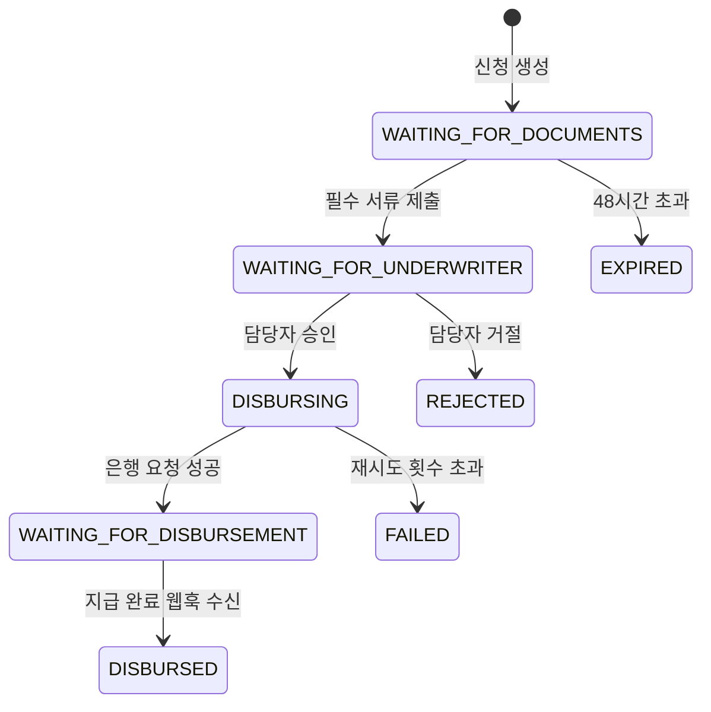
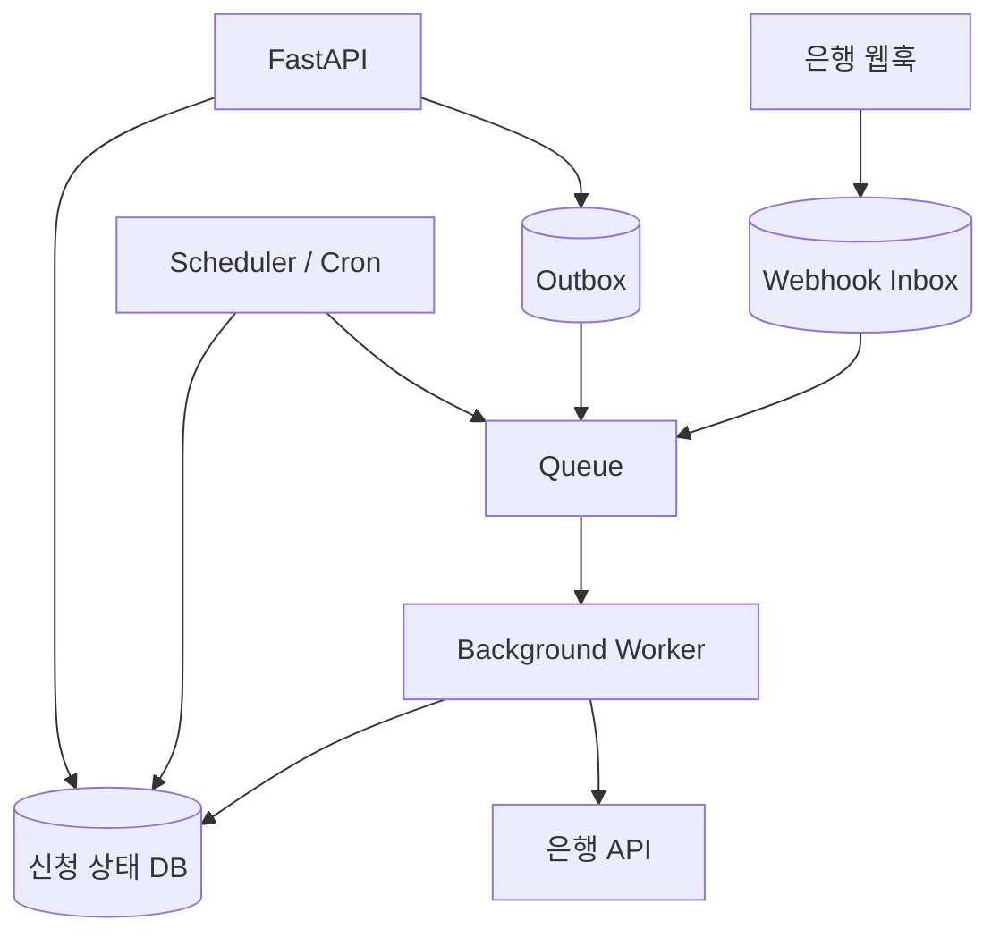
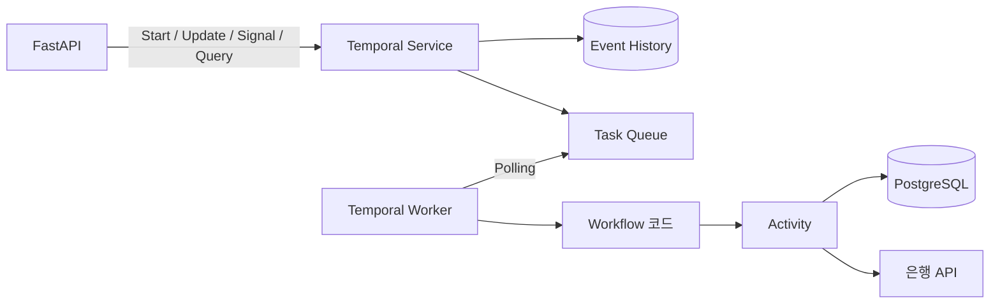

# 서버가 재시작돼도 업무는 계속됩니다: Temporal로 대출 신청 워크플로 만들기

> 예제 코드는 [lending-workflow](https://github.com/jaeyoung0509/lending-workflow)에서 확인하실 수 있습니다.

## 왜 이 글을 쓰게 되었나

처음에는 상태를 오래 들고 가는 업무를 구현하는 일을 가능하면 피했습니다. 웹 서버는 재시작될 수 있고, 요청은 언제든 중간에 끊깁니다. 그래서 API는 짧게 끝내고 상태는 DB에 저장한 뒤, 다음 작업은 Queue와 Worker에 넘기는 **stateless**한 구조를 택하는 편이 자연스러웠습니다.

그 선택 자체는 합리적입니다. 다만 대출 신청처럼 사람의 입력, 심사, 외부 은행의 응답을 며칠 동안 기다리는 업무에서는, 상태를 없앤 것이 아니라 여러 저장소와 작업자로 **분산**한 것에 가깝습니다. 어느 상태에서 어떤 메시지를 발행해야 하는지, 실패한 작업을 언제 다시 실행할지, Worker가 죽은 뒤 무엇을 재개할지를 애플리케이션이 다시 조립해야 합니다.

특히 금융 도메인에서는 비즈니스 요구사항보다 그 주변의 신뢰성 요구사항이 먼저 눈에 들어오는 순간이 많았습니다. “지급한다”라는 한 문장을 구현하려고 멱등성 키, DB 트랜잭션과 이벤트 발행의 원자성, 중복 웹훅, 재시도, 장애 복구를 먼저 설계하게 됩니다. 모두 반드시 필요한 일입니다. 다만 업무 흐름을 읽고 싶은 코드가 인프라 안전장치 사이에 묻히는 아쉬움도 남습니다.

Temporal은 이 문제를 없애는 도구라기보다, **업무의 진행과 복구를 코드 수준에서 표현하게 해주는 실행 플랫폼**입니다. Worker나 네트워크가 실패해도 Workflow를 재개하도록 설계되어 있어, 애플리케이션은 “지금 어떤 결정을 기다리고, 다음에 무엇을 할지”를 중심에 둘 수 있습니다. [Temporal 공식 문서](https://docs.temporal.io/)도 이를 장애·네트워크 오류 뒤에 실행을 재개하는 durable execution으로 설명합니다.

이 글에서는 그 감각을 대출 신청 예제로 풀어보겠습니다.

대출 신청 업무를 하나 구현한다고 생각해보겠습니다.

사용자가 신청서를 만들고 필요한 서류를 제출합니다. 담당자는 서류를 확인한 뒤 승인하거나 거절합니다. 승인이 끝나면 은행에 지급을 요청하고, 은행은 처리가 끝났을 때 웹훅으로 결과를 알려줍니다.

흐름만 놓고 보면 그렇게 복잡해 보이지 않습니다.

```text
신청 생성
→ 서류 제출
→ 담당자 승인
→ 은행에 지급 요청
→ 지급 완료
```

처음에는 DB에 `status` 컬럼 하나 두고 API 몇 개를 만들면 끝날 것처럼 보입니다.

그런데 막상 구현하기 시작하면 문제가 하나씩 생깁니다.

- 사용자는 오늘 신분증을 제출하고 내일 소득 증빙을 제출할 수 있습니다.
- 담당자의 검토는 며칠 뒤에 끝날 수도 있습니다.
- 은행 API가 잠시 실패할 수도 있습니다.
- 실제 지급은 완료됐는데 응답만 중간에서 사라질 수도 있습니다.
- 그사이에 API 서버나 Worker가 재시작될 수도 있습니다.

그러면 시스템은 언제든 아래 질문에 답할 수 있어야 합니다.

> 이 신청은 지금 어디까지 진행됐고, 다음에는 무엇을 해야 할까요?

이번 글에서는 이 문제를 FastAPI와 Temporal로 풀어봅니다.

신용 점수나 금리 계산처럼 대출 자체의 복잡한 정책을 구현하는 것이 목적은 아닙니다. 이번 예제에서 보고 싶은 것은 **사람과 외부 시스템을 오래 기다리는 업무를 서버 재시작과 실패에도 잃지 않고 이어가는 방법**입니다.

---

## 이번에 만들 흐름

예제의 흐름은 아래와 같습니다.



이번 예제에서는 다음 기능만 구현했습니다.

- 신청 생성
- 신분증과 소득 증빙 제출
- 담당자의 승인 또는 거절
- 은행 지급 API가 일시적으로 실패했을 때 재시도
- 은행 웹훅을 통한 지급 완료 처리
- API 서버나 Worker가 재시작된 뒤에도 현재 상태 조회

실제 신용 평가, 한도와 금리 계산, 사용자 인증, 실제 자금 이동은 제외했습니다. 이것저것 다 넣기 시작하면 코드만 복잡해지고, 정작 Temporal이 어떤 문제를 해결하는지 잘 보이지 않기 때문입니다.

---

## 진짜 문제는 API 호출이 아니라 기다리는 시간입니다

일반적인 API 요청은 짧게 끝납니다.

```text
요청을 받습니다
→ DB를 조회합니다
→ 데이터를 저장합니다
→ 응답합니다
```

하지만 이번 업무는 한 번의 HTTP 요청 안에서 끝나지 않습니다.

```text
오늘 신청 생성
→ 몇 시간 뒤 서류 제출
→ 며칠 뒤 담당자 승인
→ 은행 API 호출
→ 나중에 웹훅 수신
```

하나의 업무가 몇 시간, 길게는 며칠 동안 이어집니다.

그동안 시스템은 아래 내용을 계속 기억해야 합니다.

- 어떤 서류가 제출됐는지
- 아직 무엇을 기다리고 있는지
- 제출 기한이 언제까지인지
- 담당자가 승인했는지
- 은행에 지급 요청을 보냈는지
- 실패한 요청을 다시 보내야 하는지
- 같은 요청이나 웹훅을 이미 처리했는지

이런 흐름을 보통 **long-running workflow**라고 부릅니다.

여기서 말하는 long-running은 서버 프로세스가 며칠 동안 계속 떠 있어야 한다는 뜻이 아닙니다. 오히려 반대에 가깝습니다.

> 서버는 언제든 종료될 수 있지만, 진행 중이던 업무까지 사라지면 안 됩니다.

---

## Stateless하게 쪼개면, 상태 관리가 사라지는 것은 아닙니다

물론 Temporal 없이도 충분히 구현할 수 있습니다.

FastAPI가 요청을 받고 PostgreSQL에 현재 상태를 저장합니다. 오래 걸리는 작업은 Queue와 Worker로 넘깁니다. 제출 기한은 Scheduler가 주기적으로 확인하고, 은행 웹훅은 별도 테이블에 저장한 뒤 처리할 수 있습니다.

구조는 대략 아래와 비슷해집니다.



이 구조가 잘못됐다는 뜻은 아닙니다. 실제 서비스에서도 많이 사용하는 방식이고, 업무가 단순하다면 이쪽이 더 나은 선택일 수도 있습니다.

문제는 요구사항이 조금씩 늘어나기 시작할 때입니다.

### 상태를 안전하게 바꿔야 합니다

신청 상태를 DB에 저장하고, 현재 상태에서 가능한 요청인지 매번 검사해야 합니다.

아직 서류가 다 들어오지 않았는데 승인되거나, 지급이 끝난 신청에 다시 지급 요청이 나가면 안 됩니다. 같은 신청에 여러 요청이 동시에 들어온다면 row lock이나 optimistic lock 같은 동시성 처리도 필요합니다.

### DB 변경과 메시지 발행을 함께 다뤄야 합니다

DB 상태 변경은 성공했는데 Queue 메시지 발행만 실패할 수 있습니다.

이 문제를 피하려면 Outbox 패턴을 적용하고, Outbox 데이터를 실제 Queue로 전달하는 relay도 운영해야 합니다. Queue 메시지는 중복 전달될 수 있으므로 Consumer 역시 같은 작업이 여러 번 실행돼도 안전해야 합니다.

### 재시도와 기한 만료를 직접 관리해야 합니다

은행 API가 실패하면 일정 시간 뒤 다시 호출해야 합니다. 몇 초 뒤 다시 시도할지, 최대 몇 번까지 시도할지, 계속 실패하면 어떻게 처리할지도 정해야 합니다.

서류가 48시간 안에 제출되지 않으면 신청을 만료시켜야 하므로 Scheduler도 필요합니다. 서류 제출과 만료 처리가 거의 동시에 실행될 때 어느 쪽을 반영할지도 고민해야 합니다.

### Worker가 죽었을 때 다음 행동을 다시 계산해야 합니다

Worker가 작업 중간에 종료되면 미완료 신청을 다시 찾아야 합니다.

그리고 신청마다 아래 내용을 다시 판단해야 합니다.

```text
아직 기다리면 되는가?
작업을 다시 실행해야 하는가?
이미 처리됐지만 응답만 잃어버린 것인가?
운영자가 직접 확인해야 하는가?
```

결국 Worker는 DB에서 현재 상태를 읽고 다음 작업을 계산하는 코드가 됩니다.

```python
async def process_application(application_id: str) -> None:
    application = await repository.lock_and_load(application_id)

    if (
        application.status is WAITING_FOR_DOCUMENTS
        and application.deadline < now()
    ):
        await repository.mark_expired(application)
        return

    if application.status is APPROVED and not application.payment_id:
        await repository.create_idempotency_record(application_id)
        await queue.publish(
            DisbursementRequested(application_id)
        )
```

코드 한 조각만 보면 별것 없어 보입니다. 하지만 실제로 안전하게 운영하려면 주변에 필요한 장치가 계속 붙습니다.

```text
상태 테이블
+ Lock
+ Outbox
+ Queue
+ Retry Worker
+ Scheduler
+ Webhook Inbox
+ 중복 제거
+ 복구 작업
+ 정합성 확인 작업
```

이 방식에서는 비즈니스 규칙과 신뢰성 규칙이 여러 컴포넌트에 나뉩니다. 예를 들어 “승인되면 지급 요청을 한 번만 보낸다”는 요구사항 하나가 상태 전이, Outbox relay, Consumer의 중복 처리, 복구 배치에 걸쳐 흩어질 수 있습니다.

Temporal은 이 가운데 **장기 업무의 진행 상태를 기억하고, 실패한 뒤 다시 이어가는 부분**을 플랫폼으로 가져가는 선택지입니다. 그래서 Workflow 코드에는 `서류를 기다린다 → 승인 판단을 기다린다 → 지급을 요청한다`처럼 업무 순서를 먼저 적고, 외부 I/O와 재시도는 Activity 경계에 둘 수 있습니다. 이 말은 인프라 요구사항이 사라진다는 뜻이 아니라, 그것을 업무 흐름과 같은 코드 가까이에서 선언하고 플랫폼에 맡길 수 있다는 뜻입니다.

---

## Temporal은 무엇을 해줄까요?

Temporal은 long-running workflow를 위한 Durable Execution Platform입니다.

Workflow를 실행하던 Worker가 종료되더라도 Temporal Service에는 지금까지의 진행 기록이 남습니다. 이후 다른 Worker가 실행되면 이 기록을 바탕으로 Workflow를 복구하고, 아직 끝나지 않은 다음 작업부터 이어갑니다. Temporal Server의 History는 실행 상태를 복구하는 데 필요한 정보를 담도록 설계되어 있습니다. [Temporal Server 아키텍처 문서](https://github.com/temporalio/temporal/blob/main/docs/architecture/history-service.md)를 보면 History Event의 순서만으로 Workflow Execution의 관련 상태를 복구할 수 있다고 설명합니다.



다만 Temporal이 비즈니스 로직까지 대신 만들어주는 것은 아닙니다.

| Temporal이 관리하는 것      | 애플리케이션이 결정하는 것 |
| --------------------------- | -------------------------- |
| Workflow 진행 기록과 복구   | 어떤 상태 전이가 가능한지  |
| Task Queue와 Worker 전달    | 어떤 서류가 필요한지       |
| 오래 기다리는 Timer         | 제출 기한을 얼마로 정할지  |
| Activity 재시도와 결과 기록 | 어떤 오류를 재시도할지     |
| Signal, Update, Query 전달  | 승인과 거절 정책           |
| 완료된 Activity 결과 보존   | 외부 시스템의 멱등성 기준  |

Temporal은 신청을 승인하거나 거절하지 않습니다.

대신 아래 흐름이 중간에 사라지지 않도록 실행을 보존합니다.

```text
서류가 들어올 때까지 기다립니다
→ 담당자의 결정을 기다립니다
→ 은행 API를 호출합니다
→ 실패하면 다시 시도합니다
→ 지급 완료 웹훅을 기다립니다
```

---

## 먼저 알아둘 Temporal 개념

이번 예제에서는 다섯 가지 개념을 사용했습니다.

| 개념     | 역할                                      | 이번 예제에서의 사용      |
| -------- | ----------------------------------------- | ------------------------- |
| Workflow | 상태와 실행 순서를 관리하는 결정적인 코드 | 신청 하나의 전체 흐름     |
| Activity | DB나 HTTP 같은 외부 I/O                   | 은행 요청, 감사 기록 저장 |
| Update   | 상태를 변경하고 결과까지 기다리는 요청    | 서류 제출, 담당자 결정    |
| Signal   | 결과를 기다리지 않는 비동기 알림          | 은행 지급 완료 웹훅       |
| Query    | 상태를 변경하지 않는 조회                 | 현재 신청 상태 조회       |

## 예제 코드로 따라가 보기

앞의 설명이 추상적으로 느껴질 수 있으니, 실제 예제의 핵심 코드만 따라가 보겠습니다. 전체 코드는 [lending-workflow 저장소](https://github.com/jaeyoung0509/lending-workflow)에 있고, 아래 스니펫은 글 작성 시점의 구현에서 필요한 부분만 줄였습니다.

### 1. Workflow는 상태를 보고 다음 행동을 결정합니다

[`app/application/workflows/loan_application.py`](https://github.com/jaeyoung0509/lending-workflow/blob/main/app/application/workflows/loan_application.py)의 `run` 메서드는 상태 머신의 중심입니다. `while` 루프가 오래 살아 있는 것처럼 보이지만, `wait_condition`에서 기다리는 동안 Worker를 점유하지 않습니다.

```python
@workflow.run
async def run(self, input: StartLoanApplicationInput) -> LoanApplicationState:
    document_deadline = workflow.now() + timedelta(hours=48)

    while self.state.status not in TERMINAL_STATUSES:
        match self.state.status:
            case LoanApplicationStatus.WAITING_FOR_DOCUMENTS:
                if not await self._wait_for_command_before(document_deadline):
                    self.state = mark_expired(self.state)
                    break
                await self._process_next_command()
            case LoanApplicationStatus.WAITING_FOR_UNDERWRITER:
                await workflow.wait_condition(lambda: bool(self._commands))
                await self._process_next_command()
            case LoanApplicationStatus.DISBURSING:
                await self._initiate_disbursement()
            case LoanApplicationStatus.WAITING_FOR_DISBURSEMENT:
                await workflow.wait_condition(lambda: self._settlement is not None)
                await self._process_settlement()

    return self.state
```

여기서 중요한 것은 `workflow.now()`와 `workflow.wait_condition()`입니다. 일반 시계나 `asyncio.sleep()`이 아니라 Temporal API를 사용하므로, History를 replay할 때도 같은 시간과 대기 지점을 재현할 수 있습니다. 이 코드가 표현하는 것은 “48시간 안에 서류를 기다리고, 모두 들어오면 심사를 기다린다”라는 업무 규칙입니다. Timer 저장과 재기동 후 대기 복구 같은 실행 세부사항은 Temporal이 담당합니다.

### 2. HTTP 요청은 Workflow의 Update와 Signal로 번역합니다

FastAPI는 업무 상태를 직접 갱신하지 않습니다. [`app/api/loan_applications.py`](https://github.com/jaeyoung0509/lending-workflow/blob/main/app/api/loan_applications.py)에서 HTTP 요청을 Workflow 메시지로 바꾸는 역할만 합니다.

서류 제출은 처리 결과가 즉시 필요하므로 Update로 보냅니다. Workflow는 중복 `document_id`를 확인하고, 처리된 상태를 결과로 돌려줍니다.

```python
@router.post("/{application_id}/documents")
async def submit_document(application_id: str, command: SubmitDocumentCommand, temporal_client: Client):
    result = await temporal_client.get_workflow_handle(application_id).execute_update(
        "submit_document",
        command,
        result_type=CommandResult,
    )
    return to_response(
        result.state,
        accepted=result.accepted,
        duplicate=result.duplicate,
    )
```

반대로 은행 웹훅은 “지급 완료”라는 사실만 전달하면 되므로 Signal을 사용합니다. API는 `202 Accepted`를 바로 반환하고, Workflow가 다음 Workflow Task에서 상태를 `DISBURSED`로 바꿉니다.

```python
@webhook_router.post("/disbursements", status_code=status.HTTP_202_ACCEPTED)
async def record_disbursement_settlement(payload, application_id: str, temporal_client: Client):
    await temporal_client.get_workflow_handle(application_id).signal(
        LoanApplicationWorkflow.record_disbursement_settlement,
        payload,
    )
    return SignalAcceptedResponse()
```

이 경계 덕분에 API 서버는 상태 전이, 대기 목록, 재시도 대상을 자체 DB에서 조립하지 않아도 됩니다. 반면 상태 전이의 유효성 검사는 Workflow의 Update validator에 남아 있어, API가 늘어나도 업무 규칙의 중심은 한 곳입니다.

### 3. 실패할 수 있는 외부 호출은 Activity로 분리합니다

[`_initiate_disbursement`](https://github.com/jaeyoung0509/lending-workflow/blob/main/app/application/workflows/loan_application.py)에서는 은행 호출을 Activity로 실행하고 재시도 정책을 선언합니다.

```python
disbursement = await workflow.execute_activity(
    initiate_disbursement,
    DisbursementRequest(
        application_id=self.state.application_id,
        applicant_id=self.state.applicant_id,
        amount_krw=self.state.requested_amount_krw,
        idempotency_key=f"disbursement:{self.state.application_id}",
    ),
    start_to_close_timeout=timedelta(minutes=1),
    retry_policy=ACTIVITY_RETRY,
)
self.state = waiting_for_disbursement(self.state, disbursement.payment_id)
```

실제 HTTP 호출과 오류 분류는 [`app/application/activities/banking.py`](https://github.com/jaeyoung0509/lending-workflow/blob/main/app/application/activities/banking.py)에 있습니다. `5xx`와 네트워크 오류는 재시도 가능하게 전달하고, `4xx`는 `non_retryable=True`로 분류합니다.

```python
@activity.defn
async def initiate_disbursement(request: DisbursementRequest) -> DisbursementInitiated:
    try:
        return await BankingHttpAdapter(get_settings()).initiate_disbursement(request)
    except httpx.HTTPStatusError as exc:
        raise ApplicationError(
            f"bank API returned {exc.response.status_code}",
            type="BankingAPIError",
            non_retryable=exc.response.status_code < 500,
        ) from exc
    except httpx.RequestError as exc:
        raise ApplicationError(f"bank API unavailable: {exc}", type="BankingAPIUnavailable") from exc
```

예제용 은행 서비스도 [같은 멱등성 키의 결과를 재사용](https://github.com/jaeyoung0509/lending-workflow/blob/main/bank_service/main.py)하도록 구현되어 있습니다. 첫 요청에는 의도적으로 `503`을 내고, Temporal의 재시도 요청에는 동일한 지급으로 응답합니다. 그래서 “재시도”와 “중복 지급 방지”가 서로 다른 책임이라는 점을 직접 확인할 수 있습니다.

### 4. Worker는 Workflow와 Activity를 등록해 실행합니다

마지막으로 [`app/application/worker.py`](https://github.com/jaeyoung0509/lending-workflow/blob/main/app/application/worker.py)는 Task Queue를 polling할 Worker를 구성합니다.

```python
async with Worker(
    client,
    task_queue=settings.temporal_task_queue,
    workflows=[LoanApplicationWorkflow],
    activities=[
        record_application_created,
        record_document_submitted,
        record_underwriting_decision,
        initiate_disbursement,
    ],
):
    await asyncio.Future()
```

새 Worker가 같은 Task Queue를 polling하면, 이전 Worker가 사라진 뒤에도 Temporal Service가 남긴 History를 받아 Workflow를 replay할 수 있습니다. 그래서 Worker 프로세스를 “업무 상태의 주인”으로 보지 않고, Workflow를 실행하는 교체 가능한 실행자로 볼 수 있습니다.

---

구조를 간단하게 정리하면 FastAPI는 HTTP 요청을 Temporal 명령으로 바꾸고, Workflow가 실제 업무 상태를 관리합니다.

```text
POST /loan-applications             → Workflow Start
POST /{id}/documents                → Update
POST /{id}/underwriting-decisions   → Update
POST /webhooks/bank/disbursements   → Signal
GET  /{id}                          → Query
```

현재 조회 API는 PostgreSQL을 읽는 것이 아니라 Workflow Query를 직접 호출합니다. PostgreSQL은 신청 상태의 조회 원본이라기보다, 감사와 운영 확인을 위한 projection으로 사용했습니다.

---

## Event History가 실행을 어떻게 복구할까요?

Temporal을 처음 접했을 때 가장 헷갈렸던 부분은 이 지점이었습니다.

Worker가 죽었다가 다시 뜨면 Python 메모리를 그대로 복원해주는 걸까요?

그렇지는 않습니다.

Temporal은 실행 중인 Python frame을 저장하는 대신, Workflow가 만든 명령과 그 결과를 **append-only Event History**로 기록합니다.

지급을 요청하는 코드를 보겠습니다.

```python
payment = await workflow.execute_activity(
    initiate_disbursement,
    DisbursementRequest(
        application_id=self.state.application_id,
        applicant_id=self.state.applicant_id,
        amount_krw=self.state.requested_amount_krw,
        idempotency_key=f"disbursement:{self.state.application_id}",
    ),
    start_to_close_timeout=timedelta(minutes=1),
    retry_policy=ACTIVITY_RETRY,
)

self.state = waiting_for_disbursement(
    self.state,
    payment.payment_id,
)
```

첫 실행에서 `execute_activity()`는 은행 API를 직접 호출하지 않습니다. Workflow는 “이 Activity를 실행해달라”는 Command를 만들고, Temporal Service가 Activity Task를 Task Queue에 넣습니다.

Activity Worker가 Task를 가져가 은행 API를 호출한 뒤 결과를 돌려주면, Temporal Service가 그 결과를 Event History에 추가합니다.

```text
WorkflowExecutionStarted
→ ActivityTaskScheduled(initiate_disbursement)
→ ActivityTaskStarted
→ ActivityTaskCompleted(payment_id=payment-loan-123)
```

여기서 Worker가 종료되고 다른 Worker가 Workflow Task를 가져갔다고 가정해보겠습니다.

새 Worker는 Workflow 코드를 처음부터 다시 실행합니다. 하지만 같은 `execute_activity()` 줄에 도달했을 때 SDK가 이미 기록된 `ActivityTaskCompleted` 이벤트를 확인합니다.

그래서 은행 API를 다시 호출하지 않고, History에 저장된 `payment` 결과를 반환합니다.

```python
# 첫 실행
payment = await workflow.execute_activity(...)
# Activity Worker가 은행 API를 호출하고 결과를 History에 기록합니다.

# Worker 재시작 뒤 Replay
payment = await workflow.execute_activity(...)
# 같은 Activity를 다시 호출하지 않고 기록된 결과를 반환합니다.
```

“Worker가 재시작돼도 이어진다”는 말은 Python 프로세스가 상태를 들고 있다는 뜻이 아닙니다.

**Temporal Service의 Event History가 지금까지 일어난 사실을 보관하고, SDK가 그 기록을 Replay해서 현재 위치를 다시 만들어낸다는 뜻입니다.** [Temporal의 결정성 설명](https://community.temporal.io/t/workflow-determinism/4027)도 같은 History에서 같은 Command 순서를 만들어야 Replay가 가능하다고 정리합니다.

---

## 그래서 Workflow 코드는 결정적이어야 합니다

Replay가 가능하려면 같은 History를 입력받은 Workflow가 항상 같은 Command 순서를 만들어야 합니다.

아래 코드는 재실행 시점에 따라 다른 분기로 들어갈 수 있으므로 Workflow 안에서 사용하면 안 됩니다.

```python
if datetime.now().hour < 12:
    await workflow.execute_activity(morning_review, ...)
else:
    await workflow.execute_activity(afternoon_review, ...)
```

Temporal이 제공하는 시간을 사용해야 합니다.

```python
if workflow.now().hour < 12:
    await workflow.execute_activity(morning_review, ...)
else:
    await workflow.execute_activity(afternoon_review, ...)
```

같은 이유로 아래 작업도 Workflow에서 직접 실행하지 않습니다.

- DB 조회
- HTTP 요청
- 파일 읽기
- 환경 변수에 따라 달라지는 분기
- 일반적인 random 값이나 UUID 생성

이런 작업은 Activity로 분리하고, Workflow는 Activity 결과를 받아 다음 상태만 결정합니다.

---

## 오래 기다리지만 Worker를 붙잡아두지는 않습니다

신청자는 48시간 안에 서류를 제출해야 합니다.

Workflow에서는 아래처럼 기다립니다.

```python
async def _wait_for_command_before(self, deadline) -> bool:
    remaining = deadline - workflow.now()
    if remaining <= timedelta():
        return False

    try:
        await workflow.wait_condition(
            lambda: bool(self._commands),
            timeout=remaining,
        )
    except TimeoutError:
        return False

    return True
```

코드만 보면 Worker가 48시간 동안 Python 메모리를 붙잡고 기다리는 것처럼 보일 수 있습니다.

실제로는 Workflow Task가 끝난 뒤 Worker가 이 실행을 계속 점유하지 않습니다. Temporal Service가 Workflow가 무엇을 기다리는지와 Timer를 기록하고, 새로운 이벤트가 들어오거나 Timer가 만료됐을 때 다시 Workflow Task를 전달합니다.

그래서 Worker를 재시작해도 제출 기한과 대기 상태가 유지됩니다.

사람의 입력을 며칠 동안 기다리거나, 외부 시스템의 콜백을 기다리는 업무에서 Temporal이 특히 잘 맞는 이유가 바로 이 부분입니다.

---

## Update와 Signal은 왜 나눴을까요?

서류 제출과 담당자 결정은 Update로 처리했습니다.

```python
result = await handle.execute_update(
    "submit_document",
    command,
    result_type=CommandResult,
)
```

Update를 사용하면 요청자가 Workflow에서 실제 상태 변경이 끝난 결과를 기다릴 수 있습니다.

서류 제출 API는 단순히 “요청을 받았습니다”라고만 응답하지 않고, 현재 신청이 아직 서류를 기다리는지 아니면 담당자 검토 단계로 넘어갔는지 바로 돌려줍니다.

반면 은행의 지급 완료 웹훅은 Signal로 전달합니다.

```python
await handle.signal(
    LoanApplicationWorkflow.record_disbursement_settlement,
    payload,
)
```

은행은 Workflow 내부 처리가 끝날 때까지 기다릴 필요가 없습니다. 지급이 끝났다는 사실만 비동기로 전달하면 되기 때문입니다.

정리하면 아래 기준으로 나눴습니다.

```text
처리 결과까지 응답해야 한다면 Update
사실을 비동기로 전달하면 된다면 Signal
상태를 바꾸지 않고 읽기만 한다면 Query
```

---

## Activity Retry와 멱등성은 같이 가야 합니다

은행 지급 요청은 Activity로 분리했습니다.

```python
await workflow.execute_activity(
    initiate_disbursement,
    request,
    start_to_close_timeout=timedelta(minutes=1),
    retry_policy=RetryPolicy(
        initial_interval=timedelta(seconds=2),
        backoff_coefficient=2.0,
        maximum_interval=timedelta(seconds=30),
        maximum_attempts=5,
    ),
)
```

테스트용 은행 서버는 같은 멱등성 키의 첫 번째 요청에 일부러 `503`을 반환합니다. Temporal이 Activity를 재시도하면 두 번째 요청에서 정상적으로 `payment_id`를 돌려줍니다.

하지만 재시도만 설정한다고 중복 지급 문제가 사라지는 것은 아닙니다.

은행이 실제 지급을 끝낸 뒤 응답을 보내는 과정에서 네트워크가 끊길 수 있습니다.

```text
Worker → 은행: 지급 요청
은행: 지급 처리 완료
은행 → Worker: 응답 전송
네트워크: 응답 유실
```

Worker 입장에서는 성공 여부를 알 수 없으므로 Activity가 다시 실행될 수 있습니다.

그래서 같은 신청의 지급 요청에는 항상 같은 멱등성 키를 사용합니다.

```python
idempotency_key = f"disbursement:{application_id}"
```

외부 은행 시스템도 이 키를 기준으로 같은 요청을 한 번의 지급으로 처리해야 합니다.

> Temporal은 Activity 재시도를 관리해주지만, 외부 시스템의 중복 실행까지 자동으로 막아주지는 않습니다.

이 구분이 금융 업무에서 특히 중요합니다. Temporal은 “지급 요청을 실패하면 다시 시도한다”는 실행 정책을 보존하지만, 은행이 요청을 정확히 한 번만 지급으로 처리하도록 보장하는 주체는 아닙니다. 네트워크 경계의 결과는 모호할 수 있으므로, 외부 API가 이해하는 멱등성 키와 지급 조회·대사 정책은 여전히 비즈니스 시스템의 책임입니다. 즉 Temporal은 멱등성을 대체하는 것이 아니라, 멱등성을 전제로 재시도를 안전한 업무 흐름으로 끌어옵니다.

이번 개발용 은행 서버는 메모리에 멱등성 키와 결과를 저장합니다. 재시도 동작을 보여주기 위한 예제일 뿐이며, 프로세스를 재시작해도 보존되는 실제 저장소는 아닙니다.

---

## 실제로 실패시켜봐야 차이가 보입니다

Temporal의 장점은 정상 흐름만 실행해서는 크게 느껴지지 않습니다.

이 예제에서는 아래 실험을 해볼 수 있습니다.

1. 신청을 생성합니다.
2. 신분증과 소득 증빙을 제출합니다.
3. 담당자가 승인합니다.
4. 테스트용 은행 API가 첫 요청에서 `503`을 반환합니다.
5. Temporal이 Activity를 재시도합니다.
6. 은행 지급 완료 웹훅을 Signal로 전달합니다.
7. 최종 상태가 `DISBURSED`로 바뀌는지 확인합니다.

가장 재미있는 실험은 Worker 재시작입니다.

서류를 하나만 제출한 상태에서 Worker를 종료한 뒤 다시 실행합니다. Workflow는 처음부터 새로 시작되지 않습니다.

Event History를 Replay한 뒤 아래 상태로 돌아옵니다.

```text
신청 생성 완료
신분증 제출 완료
소득 증빙 대기 중
```

이후 나머지 서류를 제출하면 그대로 다음 단계로 진행됩니다.

또한 이 프로젝트의 Workflow 테스트는 실제 Local Temporal 환경에서 아래 내용을 확인합니다.

- 서류 제출 Update
- 중복 Command 처리
- 담당자 승인 Update
- Activity의 일시 실패와 재시도
- 지급 완료 Signal

단순히 Temporal Client를 Mocking하는 것이 아니라 Workflow를 실제로 실행해본다는 점이 이 예제에서 꽤 마음에 들었던 부분입니다.

---

## 그래서 long-running workflow에 왜 잘 맞을까요?

이번 예제를 만들면서 Temporal이 잘 맞는 조건은 비교적 명확하다고 느꼈습니다.

### 하나의 업무가 여러 요청에 걸쳐 이어집니다

신청 생성, 서류 제출, 담당자 결정, 은행 웹훅이 모두 다른 시점에 들어옵니다. Temporal Workflow는 이 이벤트들을 하나의 업무 실행으로 묶어줍니다.

### 기다리는 시간이 길고 일정하지 않습니다

사용자나 담당자가 언제 응답할지 알 수 없습니다. Workflow는 Worker를 계속 점유하지 않으면서도 Timer와 대기 조건을 유지합니다.

### 외부 시스템 실패가 정상적인 시나리오에 포함됩니다

은행 API처럼 일시 실패가 가능한 호출을 Activity로 분리하고, timeout과 retry policy를 코드 가까이에 둘 수 있습니다.

### 중간에 서버가 재시작돼도 이어져야 합니다

프로세스 메모리가 아니라 Event History가 실행 진행을 보존합니다. 미완료 작업을 DB에서 다시 스캔해 다음 행동을 계산하는 복구 코드를 줄일 수 있습니다.

### 사람의 판단이 흐름에 포함됩니다

담당자의 승인처럼 자동화할 수 없는 단계를 Update나 Signal로 자연스럽게 연결할 수 있습니다.

이런 특징이 있는 주문 처리, 고객 가입 심사, 환불, 승인 절차, 정산, 외부 파트너 연동 같은 업무에도 비슷하게 적용할 수 있습니다.

---

## 그렇다고 Temporal이 항상 정답은 아닙니다

여기까지 보면 Temporal이 기존의 Queue와 Scheduler를 전부 대체하는 만능 도구처럼 느껴질 수 있습니다.

하지만 실제로 도입하려면 꽤 큰 비용도 함께 따라옵니다.

### 1. 새로운 프로그래밍 모델을 배워야 합니다

Workflow와 Activity의 경계를 나눠야 하고, Replay와 결정성도 이해해야 합니다.

일반적인 Python 코드에서는 자연스러운 DB 조회, 환경 변수 읽기, 현재 시간 조회가 Workflow 안에서는 문제가 될 수 있습니다. 팀 전체가 이 제약을 이해하지 못하면 배포 뒤 non-deterministic 오류를 만들기 쉽습니다.

단순한 Queue Worker보다 처음 배우고 디버깅할 개념이 많습니다.

### 2. Workflow 코드 변경과 배포가 까다롭습니다

Workflow는 며칠이나 몇 달 동안 실행될 수 있습니다.

오늘 배포한 새 코드가 어제 시작된 Workflow의 기존 Event History와 맞지 않으면 Replay가 깨질 수 있습니다. 그래서 Patching이나 Worker Versioning을 사용하고, 경우에 따라 여러 버전의 Worker를 동시에 운영해야 합니다.

일반적인 웹 서버처럼 새 버전을 배포하고 이전 인스턴스를 바로 모두 내리는 방식으로 끝나지 않을 수 있습니다.

### 3. Event History도 무한하지 않습니다

Temporal이 오래 실행할 수 있다고 해서 하나의 Workflow Run에 이벤트를 끝없이 쌓아도 된다는 뜻은 아닙니다.

공식 문서 기준으로 하나의 Workflow Execution History에는 51,200개 이벤트 또는 50MB 제한이 있습니다. 장기간 계속되는 Workflow라면 `Continue-As-New`를 사용해 현재 상태는 넘기고 새로운 Run으로 이어가는 설계가 필요합니다.

즉 long-running workflow를 만들어준다고 해서 History 관리까지 완전히 잊어도 되는 것은 아닙니다.

### 4. Self-hosting은 생각보다 운영 범위가 큽니다

로컬에서는 `temporal server start-dev`나 Docker Compose로 쉽게 실행할 수 있습니다.

하지만 프로덕션에서 직접 운영하려면 Temporal Service만 띄우는 것으로 끝나지 않습니다.

- Persistence DB 운영
- Visibility 설정
- Namespace와 Retention 관리
- TLS/mTLS, 인증과 권한
- Service와 SDK Metrics 수집
- 서버와 DB Schema 업그레이드
- Archival
- 장애 복구와 필요 시 Multi-Cluster Replication

Temporal을 도입해 애플리케이션의 복구 복잡성을 줄였지만, 그만큼 새로운 플랫폼을 운영해야 하는 셈입니다. 작은 팀이라면 이 부담이 꽤 클 수 있습니다.

### 5. Temporal Cloud도 공짜 운영은 아닙니다

Temporal Cloud를 사용하면 Temporal Service, Persistence, Visibility와 관련된 운영 부담은 크게 줄일 수 있습니다.

다만 Workflow와 Activity 코드를 실행하는 Worker는 여전히 우리 환경에 배포하고 운영해야 합니다. Worker의 배포, 로그, 메트릭, autoscaling까지 Cloud가 모두 대신해주는 구조는 아닙니다.

비용은 Workflow Start, Activity 실행과 재시도, Signal, Timer 같은 Actions와 Event History Storage를 기준으로 발생합니다. 플랜과 단가는 바뀔 수 있으므로 도입 검토 시에는 [Temporal Cloud 가격 페이지](https://docs.temporal.io/cloud/pricing)의 최신 조건으로 실제 트래픽을 대입해보는 편이 안전합니다.

특히 downstream 장애가 길게 이어지는 상황에서 Activity를 너무 공격적으로 재시도하면 Actions와 비용도 함께 늘어날 수 있습니다.

### 6. 락인은 분명히 생깁니다

Temporal Server와 SDK는 오픈소스이므로 Temporal Cloud라는 특정 SaaS에 완전히 묶이는 것은 아닙니다. Cloud에서 Self-hosted로 옮기는 선택지는 남아 있습니다.

하지만 애플리케이션 코드 자체는 Temporal의 프로그래밍 모델에 깊이 들어갑니다.

- Workflow와 Activity
- Signal, Update, Query
- Workflow ID와 Event History
- Retry Policy와 Timer
- Continue-As-New
- Worker Versioning

이 구조를 다른 Queue나 Workflow Engine으로 바꾸려면 실행 중인 Workflow 상태까지 포함해 상당 부분을 다시 설계해야 합니다.

그래서 제 기준에서는 **Temporal Cloud에 대한 vendor lock-in보다 Temporal programming model에 대한 architectural lock-in이 더 크다**고 보는 편이 맞습니다.

### 7. 단순한 작업에는 오히려 과할 수 있습니다

아래와 같은 작업이라면 Temporal까지 가져오는 것이 오히려 복잡성을 늘릴 수 있습니다.

- 몇 초 안에 끝나는 단순 비동기 작업
- 실패하면 메시지를 다시 처리하는 정도로 충분한 작업
- 업무 상태가 한두 단계뿐인 CRUD
- 운영 중인 Workflow를 오래 보존할 필요가 없는 작업

이런 경우에는 SQS, Celery, Sidekiq 같은 Queue 기반 Worker나 간단한 Scheduler가 더 이해하기 쉽고 저렴할 수 있습니다.

결국 Temporal의 장점은 무료가 아닙니다.

기존에 애플리케이션 곳곳에 흩어져 있던 상태 복구와 재시도 복잡성을 줄이는 대신, **Temporal의 실행 모델과 운영 방식이라는 새로운 복잡성을 받아들이는 선택**에 가깝습니다.

---

## 마무리

대출 신청처럼 사람과 외부 시스템을 기다리는 업무는 정상 흐름만 보면 단순합니다.

하지만 아래 상황까지 고려하기 시작하면 구조가 빠르게 복잡해집니다.

```text
서버가 중간에 종료된다면?
은행 API가 잠시 실패한다면?
지급은 끝났지만 응답만 사라진다면?
같은 요청이 두 번 들어온다면?
며칠 동안 아무 입력도 들어오지 않는다면?
```

Temporal은 이런 업무의 실행 기록을 Event History에 남기고, Worker가 종료돼도 다른 Worker가 이어서 처리할 수 있도록 도와줍니다.

덕분에 애플리케이션에서는 여러 복구 장치를 따로 조합하기보다, 업무 흐름을 비교적 자연스러운 코드로 표현할 수 있습니다.

```text
서류를 기다립니다
→ 담당자의 결정을 기다립니다
→ 은행에 지급을 요청합니다
→ 실패하면 다시 시도합니다
→ 지급 완료 알림을 기다립니다
```

물론 멱등성, 상태 전이 규칙, 외부 시스템 검증, Workflow 배포 전략까지 Temporal이 대신 해결해주지는 않습니다. Self-hosting에는 적지 않은 운영 리소스가 필요하고, Cloud를 사용하면 비용과 서비스 의존성이 생깁니다. 코드도 Temporal의 프로그래밍 모델에 맞춰 작성해야 합니다.

그래서 모든 비동기 작업을 Temporal로 옮기는 접근은 좋은 선택이 아닐 수 있습니다.

다만 **업무가 오래 이어지고, 사람이나 외부 시스템을 기다리며, 실패 뒤에도 정확히 이어져야 한다면** Temporal을 검토할 이유는 충분합니다.

이번 예제에서 그 차이를 가장 쉽게 확인하는 방법은 단순합니다.

서류를 하나 제출한 뒤 Worker를 종료하고 다시 실행해보시면 됩니다.

Worker 프로세스는 사라졌지만, 신청 Workflow는 여전히 나머지 서류를 기다리고 있습니다.

그게 이번 프로젝트에서 확인하고 싶었던 Temporal의 핵심이었습니다.

---

## 참고 자료

- [Temporal Documentation](https://docs.temporal.io/)
- [Temporal Server: History Service architecture](https://github.com/temporalio/temporal/blob/main/docs/architecture/history-service.md)
- [Workflow Determinism explained by Temporal](https://community.temporal.io/t/workflow-determinism/4027)
- [Self-hosted Temporal Service guide](https://docs.temporal.io/self-hosted-guide)
- [Workflow Execution limits](https://docs.temporal.io/workflow-execution/limits)
- [Worker Versioning](https://docs.temporal.io/production-deployment/worker-deployments/worker-versioning)
- [Temporal Cloud pricing](https://docs.temporal.io/cloud/pricing)
