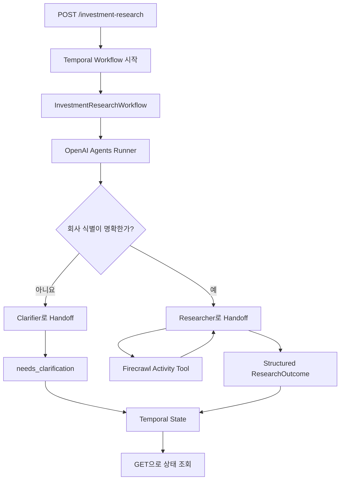

# Temporal을 활용해 Durable AI Workflow 구현하기

OpenAI Agents SDK로 에이전트를 만드는 일은 생각보다 간단합니다. Agent에 instructions와 tools를 넣고 `Runner.run()`을 호출하면 모델 호출, Tool 실행, Handoff가 하나의 Agent loop 안에서 이어집니다.

```python
result = await Runner.run(
    starting_agent=orchestrator,
    input="OpenAI의 투자 정보를 조사해 주세요.",
)

return result.final_output
```

프로토타입에서는 이 정도면 충분합니다. 문제는 이 코드가 실제 서비스에서 수천, 수만 개의 장기 실행으로 늘어났을 때입니다.

```text
모델 호출 1 완료
→ 검색 API 호출 완료
→ 모델 호출 2 완료
→ 문서 3개 수집 완료
→ 모델 호출 3 완료
→ 최종 결과를 저장하기 직전에 Worker 종료
```

마지막 줄에서 실패했지만 비용은 마지막 한 줄에만 들지 않았습니다. 모델 토큰, 검색 API 요금, 외부 서비스의 rate limit, 네트워크 시간, 사용자가 기다린 시간이 모두 앞 단계에 쌓여 있습니다. 프로세스를 처음부터 다시 실행하면 그 비용을 다시 지불해야 하고, 비결정적인 모델과 검색 결과가 이전 실행과 같으리라는 보장도 없습니다.

그래서 프로덕션 Agent에서 신뢰성은 단순히 “재시도한다”는 뜻으로 끝나지 않습니다.

> 실패했을 때 어디부터 다시 시작하며, 이미 성공한 비싼 계산을 얼마나 보존할 수 있는가?

이 글에서는 직접 만든 투자 정보 리서치 예제를 기준으로 OpenAI Agents SDK와 Temporal을 함께 사용하면 이 질문에 어떻게 답할 수 있는지 살펴봅니다. 먼저 공식 Cookbook과 이 글에서 다룰 전체 코드를 함께 열어두면 좋습니다.

<LinkPreview
  href="https://docs.temporal.io/ai-cookbook/openai-agents-sdk-python"
  site="Temporal Docs"
  title="Durable agent with tools using the OpenAI Agents SDK"
  description="OpenAIAgentsPlugin과 activity_as_tool을 이용해 모델 호출과 Tool 실행을 durable하게 만드는 공식 Python Cookbook입니다."
/>

<LinkPreview
  href="https://github.com/jaeyoung0509/temporal-examples/tree/main/react-agents"
  site="GitHub"
  title="jaeyoung0509/temporal-examples · react-agents"
  description="이 글에서 살펴보는 투자 리서치 Agent의 Workflow, Activity, FastAPI, 테스트 전체 코드입니다."
/>

> **이 글에서 OpenAI가 의미하는 것**
>
> 예제는 OpenAI **Agents SDK**의 Agent, Handoff, Runner, tracing 인터페이스를 사용합니다. 실제 모델 호출은 OpenAI 호환 API를 통해 Gemini로 보냅니다. 즉, 에이전트 프레임워크와 모델 제공자는 서로 교체 가능한 별도 경계입니다.

## Agent는 똑똑해졌고, 실행은 길어졌습니다

처음의 LLM 애플리케이션은 prompt 하나를 보내 completion 하나를 받는 짧은 요청에 가까웠습니다. 이후 reasoning과 tools가 붙었고, 이제는 여러 Agent가 Handoff하며 목적을 달성하는 multi-step workflow로 확장되고 있습니다.

OpenAI Agents SDK는 이 구조를 `Agent`, `Handoff`, `Guardrail`, `Session` 같은 작은 primitive로 표현하고 Agent loop의 생명주기를 관리합니다. [OpenAI 공식 문서](https://developers.openai.com/api/docs/guides/agents#compare-the-responses-api-and-agents-sdk)에 따르면 SDK는 Agent loop, multi-agent Handoff, resumable run state, guardrail과 tracing을 제공합니다.

이 추상화 덕분에 Agent를 정의하는 일은 쉬워졌습니다. 하지만 `Runner.run()`을 실행하는 Python 프로세스 자체가 죽지 않는다는 보장은 SDK의 책임이 아닙니다. Agent의 추론이 길어지고 Tool이 늘어날수록 애플리케이션은 모델 하나를 호출하는 코드가 아니라 여러 외부 시스템을 엮는 분산 시스템에 가까워집니다.

여기서 Temporal의 역할이 생깁니다. Temporal은 Agent를 더 영리하게 만들지 않습니다. 대신 실행의 진행 상태를 Event History에 남기고, Worker가 중단되면 그 기록을 replay해 완료된 결과를 재사용하면서 실행을 이어갑니다.

2025년 처음 발표된 Temporal의 OpenAI Agents SDK 통합은 2026년 3월 23일 기준 GA가 되었습니다. 발표 당시 설명과 현재 상태는 [Temporal 공식 발표 글](https://temporal.io/blog/announcing-openai-agents-sdk-integration)에서 함께 확인할 수 있습니다.

<YouTube
  videoId="k8cnVCMYmNc"
  title="OpenAI and Temporal: Building Durable, Production Ready Agents"
  caption="AI Engineer World's Fair — OpenAI Agents SDK 실행을 Temporal Activity로 바꾸는 통합의 배경과 데모입니다."
/>

## 이번 예제: 투자 정보를 조사하는 ReAct Agent

예제는 회사 이름, 웹사이트, 국가 같은 정보를 받아 투자 내역을 조사합니다. Orchestrator가 회사 식별이 충분한지 판단하고, 모호하면 Clarifier로, 충분하면 Researcher로 Handoff합니다. Researcher는 Firecrawl 검색 Tool을 반복 호출한 뒤 출처가 포함된 `InvestmentSnapshot`을 반환합니다.



코드의 책임은 다음처럼 나뉩니다.

| 컴포넌트 | 책임 |
| --- | --- |
| FastAPI | Workflow를 시작하고 `workflow_id` 반환, 상태 조회 |
| Temporal Workflow | 실행 상태와 분기, 복구 가능한 orchestration |
| OpenAI Agents SDK | Agent loop, Tool 선택, Handoff, structured output |
| Firecrawl Activity | 검색과 문서 수집이라는 비결정적 I/O |
| Pydantic models | API, Workflow, Tool, 모델 출력 사이의 계약 |

중요한 점은 모든 것을 작은 Activity로 쪼갠 것이 아니라, **다시 실행할 때 비용이 들거나 결과가 달라지는 경계**를 durable하게 만들었다는 것입니다.

## 코드에서 내구성이 생기는 세 지점

### 1. `Runner.run()`은 그대로 Workflow 안에 둡니다

Workflow 코드는 예상보다 작습니다.

```python
@workflow.defn
class InvestmentResearchWorkflow:
    @workflow.run
    async def run(self, input: ResearchWorkflowInput) -> ResearchJobState:
        self._set_state(ResearchStatus.RUNNING, ResearchStage.ORCHESTRATING)

        result = await Runner.run(
            build_orchestrator_agent(input.model),
            input=_research_prompt(input),
        )

        outcome = result.final_output_as(
            ResearchOutcome,
            raise_if_incorrect_type=True,
        ).root
        # clarification 또는 completed 상태 저장
```

기존 Agents SDK의 프로그래밍 모델을 버리고 별도의 그래프 DSL로 다시 작성하지 않습니다. `OpenAIAgentsPlugin`이 Agents SDK의 모델 호출을 Temporal Activity로 실행하도록 연결합니다.

```python
def openai_agents_plugin() -> OpenAIAgentsPlugin:
    return OpenAIAgentsPlugin(
        model_params=ModelActivityParameters(
            start_to_close_timeout=timedelta(minutes=2),
        )
    )
```

같은 plugin 설정을 API의 Temporal Client와 Worker 양쪽에 등록합니다. 모델 호출이 Activity 경계를 가지므로 완료된 응답은 Workflow History와 연결되고, Workflow replay 중에는 모델을 무조건 다시 호출하는 대신 기록된 완료 결과를 사용합니다.

### 2. 외부 검색은 `activity_as_tool`로 감쌉니다

Research Agent가 사용하는 Firecrawl은 네트워크 I/O이고 요금과 rate limit이 있는 외부 서비스입니다. 따라서 일반 `@function_tool`이 아니라 Temporal Activity로 정의한 뒤 Agent Tool로 노출합니다.

```python
def _search_tool() -> Tool:
    return activity_as_tool(
        firecrawl_search_activity,
        start_to_close_timeout=timedelta(minutes=3),
        summary=(
            "Search the web with Firecrawl and return "
            "source-backed markdown documents."
        ),
    )
```

```python
@activity.defn(name="firecrawl_search")
def firecrawl_search(request: FirecrawlSearchRequest) -> FirecrawlSearchResult:
    pages = client.search(
        request.query,
        limit=request.limit,
        scrape_limit=request.scrape_limit,
    )
    return build_firecrawl_search_result(
        request,
        pages,
        retrieved_at=datetime.now(UTC),
    )
```

`datetime.now()`와 HTTP 호출은 replay되어야 하는 Workflow 안이 아니라 Activity 안에 있습니다. 반대로 Workflow에서 필요한 시간은 `workflow.now()`를 사용합니다. 이 구분은 취향이 아니라 Temporal의 replay가 동일한 Command 순서를 만들어야 한다는 결정성 규칙 때문입니다.

### 3. 경계의 입출력을 Pydantic으로 닫습니다

모델 출력은 `completed`와 `needs_clarification`의 discriminated union입니다.

```python
ResearchOutcomeValue = Annotated[
    CompletedResearchOutcome | ClarificationResearchOutcome,
    Field(discriminator="status"),
]

class ResearchOutcome(RootModel[ResearchOutcomeValue]):
    pass
```

Firecrawl 역시 `FirecrawlSearchRequest`와 `FirecrawlSearchResult`를 사용합니다. 타입이 있다고 사실성이 자동으로 보장되지는 않지만, 최소한 완료된 단계의 결과가 어떤 모양인지, 다음 단계가 무엇을 받을지, replay할 때 어떤 값을 복원해야 하는지가 명확해집니다.

## 실제로 실패하면 어디서 재개될까요?

“Temporal을 붙이면 실패 지점부터 재개한다”는 표현은 편리하지만 조금 더 정확할 필요가 있습니다. Temporal의 복구 단위는 임의의 Python 한 줄이 아니라 **Workflow History에 완료가 기록된 durable boundary**입니다.

| 실패 시점 | 이 예제에서 일어나는 일 |
| --- | --- |
| Firecrawl Activity가 완료된 뒤 Worker 종료 | 완료 결과를 History에서 읽으므로 같은 Tool 호출을 다시 실행하지 않고 다음 Agent turn을 이어감 |
| Firecrawl Activity 실행 도중 Worker 종료 | 완료 기록이 없으므로 Activity가 다시 시도될 수 있음. 현재 Activity가 검색과 scrape를 함께 하므로 둘 다 재실행될 수 있음 |
| 모델 Activity 완료 뒤 Workflow Worker 종료 | 저장된 모델 결과를 replay하고 다음 분기부터 계속 진행 |
| 모델 호출 도중 timeout 또는 rate limit | Activity retry 정책의 범위에서 모델 호출을 다시 시도. 실패한 요청의 과금 여부는 모델 제공자 정책에 따름 |
| 최종 결과의 schema 검증이 계속 실패 | 해당 Agent/모델 Activity가 성공하지 못한 것이므로 무한히 공짜로 복구되는 것이 아님. 재시도 상한과 fallback이 필요 |

핵심은 “어떤 실패도 정확히 한 줄 뒤에서 재개된다”가 아닙니다.

> 이미 성공했다고 기록된 모델·Tool 호출은 재사용하고, 완료되지 않은 Activity만 정책에 따라 다시 실행할 수 있다는 것이 정확한 설명입니다.

이 차이를 알고 Activity 크기를 정해야 합니다. Firecrawl 검색과 각 문서 scrape를 서로 다른 비용·복구 단위로 운영하고 싶다면 현재 하나인 Activity를 더 나눌 수 있습니다. 반대로 너무 잘게 나누면 History와 운영 복잡성이 커집니다. Activity는 함수 크기가 아니라 **retry와 비용을 함께 묶어도 되는 업무 단위**여야 합니다.

## 실행 하나가 사라지지 않는 작업이 됩니다

API는 리서치가 끝날 때까지 HTTP 연결을 붙잡지 않습니다. Workflow를 시작하고 `202 Accepted`와 ID를 반환합니다.

```python
workflow_id = f"investment-research-{uuid4()}"

await temporal_client.start_workflow(
    InvestmentResearchWorkflow.run,
    workflow_input,
    id=workflow_id,
    task_queue=settings.temporal_task_queue,
)

return ResearchJobResponse(
    workflow_id=workflow_id,
    status=ResearchStatus.QUEUED,
)
```

클라이언트는 ID로 상태를 조회합니다. Workflow의 local state는 Query로 외부에 노출됩니다.

```python
@workflow.query
def get_state(self) -> ResearchJobState:
    return self._state
```

이렇게 되면 Agent 실행은 한 번의 함수 호출이 아니라 이름을 가진 작업이 됩니다. Worker를 여러 개 띄우면 같은 Task Queue의 작업을 나눠 처리할 수 있고, 특정 Worker가 죽어도 실행의 소유권이 그 프로세스와 함께 사라지지 않습니다.

다만 “수천, 수만 개로 확장된다”는 말에는 조건이 붙습니다. Worker 수, Task Queue backlog, provider rate limit, Temporal Namespace 용량, payload 크기와 비용 예산을 함께 설계해야 합니다. multi-tenant 환경이라면 큰 고객의 작업이 Queue를 독점하지 않도록 Task Queue Fairness 같은 운영 정책도 검토해야 합니다.

## 통합하면서 실제로 아쉬웠던 점

Temporal과 OpenAI Agents SDK의 결합은 생각보다 자연스럽습니다. `OpenAIAgentsPlugin`을 등록하면 기존 `Runner.run()` 중심의 코드를 크게 바꾸지 않고 모델 호출을 durable boundary로 옮길 수 있습니다. 다만 **OpenAI가 호스팅하지 않는 외부 Tool을 사용할 때는 Activity 경계를 직접 만들어야 한다**는 점은 아직 번거롭게 느껴졌습니다.

예를 들어 OpenAI 모델과 Agents SDK의 [hosted Web Search](https://developers.openai.com/api/docs/guides/tools-web-search)를 사용한다면 Agent 정의에 Tool을 바로 추가할 수 있습니다.

```python
from agents import Agent, WebSearchTool

researcher = Agent(
    name="Investment Researcher",
    instructions="Find source-backed investment information.",
    tools=[WebSearchTool()],
)
```

Web Search의 구현과 실행은 OpenAI가 관리하므로 애플리케이션에서 검색 함수를 따로 만들거나 그 검색 Tool만을 위한 Temporal Activity를 Worker에 등록하지 않아도 됩니다. Temporal plugin이 감싸는 모델 호출 안에서 hosted Tool을 사용하게 됩니다.

반면 이 예제는 모델 제공자로 Gemini를 사용하고 검색에는 Firecrawl을 선택했습니다. Firecrawl은 Agents SDK의 hosted Tool이 아니라 애플리케이션이 직접 호출하는 외부 서비스입니다. 그래서 다음 경계를 모두 코드로 정의해야 했습니다.

```python
# 1. 외부 I/O를 Activity로 구현
@activity.defn(name="firecrawl_search")
def firecrawl_search(
    request: FirecrawlSearchRequest,
) -> FirecrawlSearchResult:
    ...

# 2. Activity를 Agent Tool로 변환
search_tool = activity_as_tool(
    firecrawl_search_activity,
    start_to_close_timeout=timedelta(minutes=3),
)

# 3. Worker에도 Activity 등록
Worker(
    ...,
    activities=[firecrawl_search],
)
```

이 구분에는 이유가 있습니다. Temporal은 Firecrawl 호출의 적절한 timeout, retry 가능한 오류, 직렬화할 입출력, 멱등성 조건을 자동으로 알 수 없습니다. 외부 I/O를 Activity로 드러내야 호출의 완료 여부를 History에 남기고 독립적으로 재시도할 수 있습니다. 운영 관점에서는 오히려 정직한 경계입니다.

그럼에도 개발 경험에는 차이가 큽니다.

```text
OpenAI hosted Web Search
Agent에 Tool 추가
→ 별도 검색 구현과 Activity 등록 없음

Firecrawl 같은 외부 Tool
Activity 구현
→ activity_as_tool 변환
→ Worker 등록
→ timeout·retry·입출력 계약 관리
```

즉, Temporal + OpenAI Agents SDK가 잘 통합되어 있어도 hosted Tool의 바깥으로 나가는 순간 Temporal의 Activity 모델을 직접 다뤄야 합니다. 다양한 검색·데이터 provider를 선택하는 실제 서비스에서는 이 adapter 코드가 Tool마다 반복될 수 있습니다. Activity Tool용 decorator나 provider별 adapter, timeout·retry preset, Worker 자동 등록 같은 보조 추상화가 더해진다면 이 간극이 줄어들 것 같습니다.

이것은 Firecrawl을 선택한 것이 잘못됐다는 뜻도, 통합이 불완전하다는 뜻도 아닙니다. **외부 Tool의 운영 경계는 필요하지만, 그 경계를 선언하는 개발 경험은 더 간결해질 여지가 있다**는 것이 이번 구현에서 느낀 아쉬움입니다.

## 이 예제에서 의도적으로 다루지 않은 것들

아래 항목은 Temporal + OpenAI Agents SDK 통합의 단점이나 예제 코드의 결함이라기보다, durable execution의 핵심 흐름에 집중하기 위해 이번 글의 범위에서 제외한 프로덕션 고려사항입니다.

| 고려사항 | 프로덕션에서 확인할 내용 |
| --- | --- |
| 요청 멱등성 | 클라이언트의 idempotency key나 비즈니스 request ID를 Workflow ID로 사용하고 중복 시작 정책을 정해야 합니다. |
| Side effect 멱등성 | 결제, 이메일 발송, 티켓 생성은 외부 시스템의 idempotency key, deduplication, reconciliation이 필요합니다. |
| 비용 상한 | `max_turns`, 검색·출처 수, token·cost budget을 두고 상한 도달 시 축약, 승인 요청, 실패 중 어떤 정책을 적용할지 정해야 합니다. |
| History와 payload | 큰 검색 원문은 object storage에 두고 Workflow에는 key, hash, excerpt를 남겨야 합니다. 긴 실행에는 context trimming과 Continue-As-New도 검토해야 합니다. |
| Human-in-the-loop | 현재 Clarifier는 `needs_clarification`으로 종료합니다. 같은 실행을 이어가려면 Update나 Signal을 기다리는 흐름이 필요합니다. |
| 사실 검증 | Pydantic은 데이터 형태를 검증할 뿐입니다. 출처와 주장 간 검증, 신뢰 도메인 정책, 충돌 처리, eval dataset은 별도 설계가 필요합니다. |
| 관찰 가능성과 보안 | Temporal Web UI와 Agent trace를 함께 연결하고, History와 trace에 남는 prompt·원문·출력의 암호화, 보존 기간, redaction, 접근 제어를 정해야 합니다. |

이 항목들은 예제를 “보완해야만 성립하는 코드”로 만들기보다는, 실제 제품으로 확장할 때 선택해야 할 다음 설계 단계로 보는 편이 정확합니다.

## 다음 실습에서 확인할 것

Durable Execution은 설명보다 장애를 직접 만들어 볼 때 훨씬 잘 이해됩니다. 이 글은 우선 초안으로 두고, 다음 실습 결과를 차례로 보강하려고 합니다.

1. Firecrawl 완료 직후 Worker를 강제 종료하고, 재시작 뒤 검색 호출 횟수가 늘지 않는지 확인합니다.
2. Firecrawl 실행 도중 Worker를 종료해 Activity 전체가 다시 실행되는지 확인합니다.
3. 모델 호출에 일시 오류와 영구 오류를 주입하고 retry 간격, 최대 시도, 최종 상태를 기록합니다.
4. 같은 리서치를 OpenAI hosted Web Search로도 구현해 Firecrawl Activity 방식과 코드, History, trace를 비교합니다.
5. Agent가 의도적으로 너무 많이 검색하게 만들고 `max_turns`와 비용 budget을 추가합니다.
6. Clarifier 결과에서 Workflow를 끝내지 않고 Update로 사용자 답변을 받아 같은 실행을 이어갑니다.
7. 큰 검색 원문을 object storage로 옮긴 뒤 History 크기를 전후 비교합니다.
8. 같은 idempotency key로 `POST`를 두 번 보내도 Workflow가 하나만 생기는지 검증합니다.

특히 다음 표를 실제 측정값으로 채우면 글의 신뢰성이 더 높아질 것입니다.

| 실험 | 장애 주입 위치 | 모델 호출 수 | Tool 호출 수 | 복구 시간 | 중복 비용 |
| --- | --- | ---: | ---: | ---: | ---: |
| Worker crash A | Firecrawl 완료 직후 | TODO | TODO | TODO | TODO |
| Worker crash B | Firecrawl 실행 중 | TODO | TODO | TODO | TODO |
| Provider timeout | 모델 응답 전 | TODO | TODO | TODO | TODO |

## 마치며

OpenAI Agents SDK는 Agent를 만드는 복잡도를 크게 낮춥니다. Agent, Tool, Handoff, structured output을 조합하면 단일 프로세스에서 꽤 정교한 workflow를 빠르게 만들 수 있습니다.

하지만 프로덕션에서 어려운 문제는 Agent loop를 작성하는 것만이 아닙니다. 수많은 실행이 동시에 돌고, 각 단계가 실제 비용이며, 외부 API와 Worker는 언젠가 실패합니다. 마지막 단계의 장애 때문에 앞에서 지불한 계산을 모두 버리는 구조는 규모가 커질수록 감당하기 어렵습니다.

Temporal과의 결합이 주는 가장 큰 가치는 “재시도 옵션 하나”가 아닙니다.

> 모델 호출과 Tool 호출을 복구 가능한 경계로 만들고, 실행의 소유권을 한 프로세스에서 durable Workflow로 옮기는 것.

그 결과 완료된 계산을 보존하고, 실패한 경계만 다시 실행하며, 작업의 현재 위치를 조회할 수 있습니다. Activity 멱등성, 비용 상한, History 크기, Workflow versioning, 보안, 사실 검증은 이 예제의 다음 범위이자 프로덕션에서 별도로 설계할 항목입니다.

한편 OpenAI hosted Tool은 Agent에 바로 연결할 수 있지만 Firecrawl 같은 외부 Tool은 Activity 구현, Tool 변환, Worker 등록이 필요했습니다. 이 운영 경계 자체는 필요하더라도, provider를 바꿀 때 반복되는 adapter 작업까지 더 매끄럽게 추상화된다면 통합의 개발 경험은 한층 좋아질 것입니다.

Temporal은 Agent의 판단을 대신하지 않습니다. 다만 그 판단을 실행하는 시스템이 실패를 견디게 만드는 단단한 바닥이 될 수 있습니다.

## 참고 자료

- [예제 코드: jaeyoung0509/temporal-examples/react-agents](https://github.com/jaeyoung0509/temporal-examples/tree/main/react-agents)
- [Temporal: Production-ready agents with the OpenAI Agents SDK + Temporal](https://temporal.io/blog/announcing-openai-agents-sdk-integration)
- [Temporal Python SDK: OpenAI Agents integration](https://github.com/temporalio/sdk-python/tree/main/temporalio/contrib/openai_agents)
- [OpenAI: Agents SDK guide](https://developers.openai.com/api/docs/guides/agents)
- [OpenAI: Web search tool](https://developers.openai.com/api/docs/guides/tools-web-search)
- [OpenAI Agents SDK Python documentation](https://openai.github.io/openai-agents-python/)
