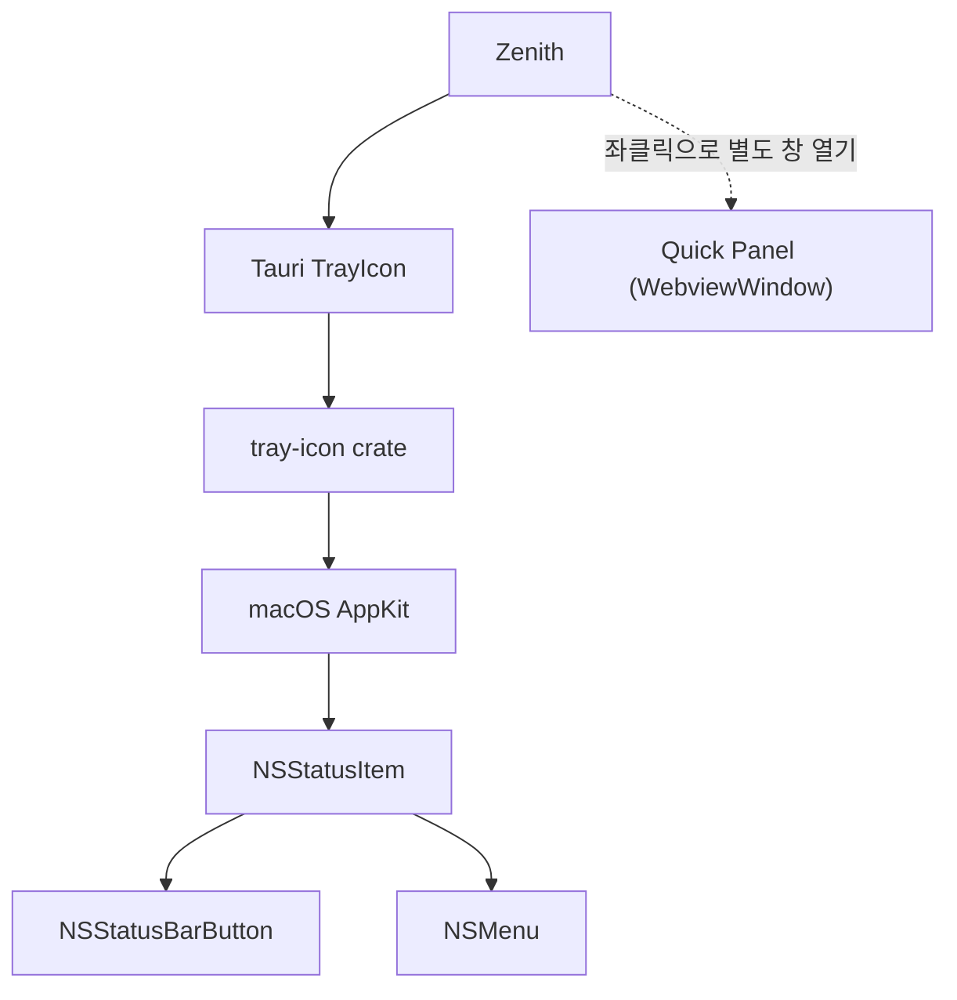
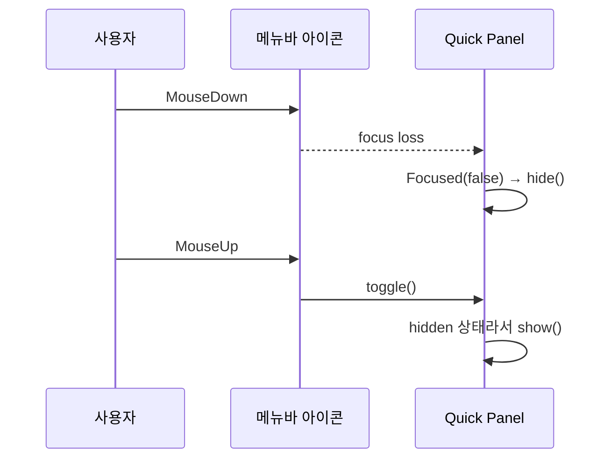

# macOS 업데이트 후 Quick Panel이 사라졌다

멀쩡히 잘 쓰던 [Zenith](https://github.com/jaeyoung0509/zenith)의 Quick Panel이 macOS 업데이트 후 갑자기 이상해졌습니다.

원래는 메뉴바 아이콘을 좌클릭하면 Quick Panel이 열리고, 우클릭하면 메뉴가 떠야 합니다. 그런데 업데이트하고 나니 좌클릭을 해도 무조건 메뉴만 열렸습니다.

<div class="article-compare" role="group" aria-label="Zenith 메뉴바 아이콘의 좌클릭과 우클릭 결과 비교">
  <figure>
    
    <figcaption>원래 좌클릭하면 열리던 Quick Panel</figcaption>
  </figure>
  <figure>
    
    <figcaption>그런데 좌클릭을 해도 이 메뉴만 떴다</figcaption>
  </figure>
</div>

처음엔 내가 이벤트 처리를 잘못 건드렸나 싶었습니다. 그런데 다른 메뉴바 앱들은 또 멀쩡했습니다.

그래서 Tauri부터 하나씩 내려가 봤습니다.

```text
Tauri → tray-icon → AppKit → NSStatusItem
```

결론부터 말하면 Zenith 코드보다는, `tray-icon`이 macOS에서 `NSStatusItem`과 `NSMenu`를 다루던 방식이 문제였습니다.

---

## Tauri부터 AppKit까지 내려가 봤다

여기서 용어만 잠깐 정리하면 이렇습니다.

`NSStatusItem`은 메뉴바의 Zenith 아이콘 하나를 나타내는 객체고, 실제로 클릭되는 버튼은 내부의 `NSStatusBarButton`입니다. 우클릭했을 때 뜨는 네이티브 메뉴는 `NSMenu`입니다.

Tauri는 이걸 직접 다루지 않고 `tray-icon`이라는 Rust crate를 통해 감싸서 제공합니다. Quick Panel은 Apple이나 Tauri 용어가 아니라, Zenith에서 좌클릭으로 띄우는 별도 `WebviewWindow`고요.



Zenith에서는 트레이 아이콘을 만들 때 아래 옵션을 쓰고 있었습니다.

```rust
.show_menu_on_left_click(false)
```

이름 그대로 좌클릭에는 메뉴를 열지 말라는 설정입니다. 여기까지만 보면 Zenith 쪽으로 클릭 이벤트가 들어와야 맞습니다.

## tray-icon의 동작이 예상과 달랐다

`tray-icon`의 macOS 구현을 따라가다가 예상과 다른 부분을 발견했습니다.

`show_menu_on_left_click(false)`를 쓰고 있는데도, 실제로는 `NSMenu`를 `NSStatusItem`에 처음부터 계속 붙여두고 있었습니다.

```rust
ns_status_item.setMenu(Some(menu));
```

그 위에서 마우스 이벤트를 가로채 좌클릭이면 앱으로 넘기고, 우클릭이면 메뉴를 여는 식이었습니다. 기존 macOS에서는 이게 동작했는데 업데이트 이후부터는 달랐습니다.

혹시나 해서 찾아보니 `tray-icon`에도 같은 증상의 이슈가 이미 올라와 있었습니다.

<LinkPreview
  href="https://github.com/tauri-apps/tray-icon/issues/355"
  site="GitHub"
  title="macOS 27 Beta click unexpected behavior · Issue #355 · tauri-apps/tray-icon"
  description="Left click on status item displays the menu instead of forwarding click events to the application."
/>

이슈에서 `setMenu()`를 빼보니 `LeftDown`, `LeftUp` 이벤트가 다시 정상적으로 들어왔습니다.

```text
// ns_status_item.setMenu(Some(menu));

LeftDown
LeftUp
RightDown
RightUp
```

여기서 거의 원인이 확정됐습니다. `NSMenu`가 붙어 있으면 AppKit이 좌클릭을 먼저 가져가 메뉴를 열고, `tray-icon`이 기다리던 이벤트는 아래까지 내려오지 않았습니다.

## macOS가 갑자기 망가뜨린 건 아니었다

처음엔 업데이트가 클릭 처리를 망가뜨린 줄 알았습니다. 그런데 Apple의 [NSStatusItem.menu 문서](https://developer.apple.com/documentation/appkit/nsstatusitem/menu)를 읽어보니 원래 스펙이 이랬습니다.

> 메뉴가 status item에 할당되면 기본 싱글 클릭 동작은 비활성화되고, 그 대신 메뉴가 표시됩니다.

```text
menu == nil  → 커스텀 클릭 액션 실행
menu != nil  → 시스템이 NSMenu 표시
```

macOS가 없던 규칙을 새로 만든 게 아니라, 기존 `tray-icon`이 예전의 느슨한 이벤트 전달에 기대고 있던 셈이었습니다. 다른 메뉴바 앱이 멀쩡했던 것도 메뉴를 상시로 붙이지 않거나, 별도 팝오버를 띄우는 방식이라면 설명이 됐습니다.

## 메뉴는 우클릭할 때만 잠깐 붙이면 됐다

결국 메뉴를 평소에는 떼어두고, 필요할 때만 붙이기로 했습니다.

```rust
let menu = stored_menu.clone();

// 우클릭하는 순간에만 연결한다.
status_item.setMenu(Some(&menu));
button.performClick(None);

// 메뉴를 연 뒤 다시 좌클릭 통로를 비운다.
status_item.setMenu(None);
```

메뉴 객체 자체를 버리는 건 아닙니다. 메모리에 들고 있다가 우클릭이 들어오면 잠깐 연결하고, 메뉴를 띄운 직후 다시 떼어냅니다.

이 변경은 `tray-icon`의 PR #365에 올라갔습니다.

<LinkPreview
  href="https://github.com/tauri-apps/tray-icon/pull/365"
  site="GitHub"
  title="fix(macos): restore tray click event forwarding on macOS 27 · Pull Request #365"
  description="Dynamically attaches and detaches NSMenu so tray click events keep reaching the application."
/>

당시에는 아직 정식 릴리스에 포함되기 전이라 Zenith에서는 Cargo의 `[patch.crates-io]`로 먼저 가져왔습니다.

```toml
[patch.crates-io]
tray-icon = { path = "patches/tray-icon" }
```

라이브러리 전체를 따로 관리할 필요 없이 로컬 패치를 쓰다가, 정식 버전이 나오면 이 설정만 지우면 됩니다. Zenith에 적용한 변경은 [PR #220](https://github.com/jaeyoung0509/zenith/pull/220)에 남겨두었습니다.

패치를 적용하니 좌클릭 이벤트가 다시 들어왔고 Quick Panel도 정상적으로 열렸습니다.

그런데 이 문제를 고치고 나니 다른 버그가 하나 더 보였습니다.

## 닫았는데 왜 다시 열리지?

열려 있는 Quick Panel을 닫으려고 메뉴바 아이콘을 클릭하면, 패널이 닫혔다가 바로 다시 열렸습니다.

처음엔 클릭 이벤트가 두 번 들어오나 싶었는데 실제 순서는 이랬습니다.



Quick Panel에는 포커스를 잃으면 숨기는 코드가 있었습니다.

```rust
WindowEvent::Focused(false) => {
    hide_quick_panel(window.app_handle());
}
```

트레이 쪽은 `MouseUp`에서 현재 보이는지를 확인하고 토글했습니다.

```rust
if visible {
    window.hide().ok();
} else {
    window.show().ok();
}
```

메뉴바를 누르는 순간 패널이 포커스를 잃고 먼저 숨겨집니다. 그 뒤 같은 클릭의 `MouseUp`이 오면 토글 로직은 이미 숨겨진 패널을 보고 다시 열어버립니다.

결국 클릭 하나가 패널을 두 번 건드리고 있었습니다.

### 400ms로 막아봤지만 오래 누르면 다시 깨졌다

처음에는 패널이 닫힌 뒤 400ms 안에 들어온 클릭을 무시했습니다.

```rust
const TRAY_TOGGLE_SUPPRESSION: Duration = Duration::from_millis(400);
```

당장은 됐습니다. 하지만 마우스를 1초 동안 누르고 있으면 `MouseDown`에서 패널이 닫힌 뒤 400ms가 지나고, 그제야 `MouseUp`이 들어옵니다. 시간만 보고 있으면 이 클릭은 다시 정상 클릭으로 오해받습니다.

```text
MouseDown → hide() → 1초 유지 → MouseUp → show()
```

400ms라는 숫자는 이벤트의 관계를 설명하지 못했습니다. 그냥 보통 클릭이면 이 안에 끝날 거라고 추측한 값이었습니다.

### 시간 대신 같은 클릭인지 기록했다

그래서 `MouseDown`에서 패널을 닫았다면, 뒤이어 들어올 `MouseUp`이 같은 클릭에서 나온 이벤트라는 상태를 남겼습니다.

```rust
#[derive(Default)]
struct QuickPanelVisibility {
    pending_tray_mouse_up: Mutex<bool>,
}
```

패널이 열린 상태에서 `MouseDown`이 오면 이 값을 `true`로 만들고 패널을 닫습니다.

```rust
MouseButtonState::Down if is_visible => {
    visibility.arm_pending_tray_mouse_up();
    hide_quick_panel(app);
}
```

뒤이어 오는 `MouseUp`은 플래그가 있으면 한 번 소비하고 끝냅니다.

```rust
MouseButtonState::Up => {
    if visibility.take_pending_tray_mouse_up() {
        return;
    }

    toggle_quick_panel(app, tray_rect);
}
```

흐름은 이 정도로 줄었습니다.

```text
패널이 열려 있음
MouseDown → pending = true → hide()
MouseUp   → pending 소비 → 아무것도 하지 않음

패널이 닫혀 있음
MouseDown → pending 변화 없음
MouseUp   → toggle() → show()
```

바탕화면을 눌러 `Focused(false)`로 닫힌 경우에는 트레이의 `MouseDown`을 거치지 않으니 플래그도 생기지 않습니다. 그 직후 메뉴바 아이콘을 눌러도 기다릴 필요 없이 바로 열립니다.

임의의 시간을 재는 대신, 같은 클릭에서 나온 `MouseDown`과 `MouseUp`의 관계를 상태로 남긴 셈입니다.

## 고치고 나서

처음에는 그냥 Tauri 쪽 이벤트 버그인 줄 알았습니다.

그런데 원인을 따라가 보니 `tray-icon`, `NSStatusItem`, `NSMenu`까지 내려가게 됐고, 그 문제를 고치고 나니 이번에는 `MouseDown → focus loss → MouseUp` 순서 때문에 또 버그가 났습니다.

웹에서는 브라우저가 많이 가려주는 부분인데, 데스크톱 앱은 OS 이벤트까지 내려가기 시작하면 생각보다 볼 게 많았습니다.

그래도 이렇게 동작을 하나씩 따라가 보는 과정 때문에 Zenith 만드는 게 재밌는 것 같습니다. 쉽지는 않지만요.

---

## 참고한 자료

- [Apple Developer: NSStatusItem](https://developer.apple.com/documentation/appkit/nsstatusitem)
- [Apple Developer: NSStatusItem.button](https://developer.apple.com/documentation/appkit/nsstatusitem/button)
- [Apple Developer: NSStatusItem.menu](https://developer.apple.com/documentation/appkit/nsstatusitem/menu)
- [Tauri Docs: TrayIconBuilder](https://docs.rs/tauri/latest/tauri/tray/struct.TrayIconBuilder.html)
- [tray-icon Issue #355](https://github.com/tauri-apps/tray-icon/issues/355)
- [tray-icon PR #365](https://github.com/tauri-apps/tray-icon/pull/365)
- [Zenith PR #220](https://github.com/jaeyoung0509/zenith/pull/220)
